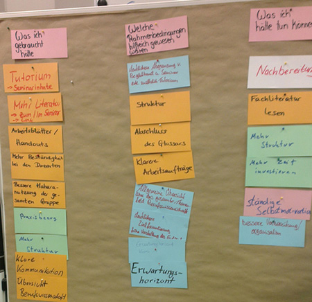

# Einsatzszenario zur Reflexion des individuellen Lernprozesses in einer Lernsituation

- - -

In diesem didaktischen Einsatzszenario reflektieren die Lernenden ihren Lernprozess anhand der Check-Auswertung und leiten Handlungsalternativen für sich selber, aber auch für die Gestaltung der Lernsituation ab. Auf Grundlage der Reflexionen der Lernenden kann die Lehrperson dann in einen zielgerichteten Austausch über anvisierte Lernergebnisse, subjektiv wahrgenommene Lernerfolge und Hürden sowie die Gestaltung der Lehrveranstaltung mit den Lernenden treten.

**Rahmen der Szenarioentwicklung**

Das Szenario wurde im Wintersemester 2016/17 im ersten Bachelorsemester in den beruflichen Fachrichtungen Elektrotechnik-Informationstechnik und Medientechnik zuerst in der Veranstaltung "Begleitband" durchgeführt und im zweiten Mastersemester mit Studierenden der beruflichen Fachrichtungen Elektrotechnik-Informationstechnik, Metalltechnik und Medientechnik leicht angepasst erneut erprobt. 

## 1. Zielgruppe des Einsatzszenarios
Das Einsatzszenario wurde zunächst mit Studierenden der beruflichen Fachrichtungen Elektrotechnik-Informationstechnik, Medientechnik und Medientechnik im ersten Bachelor-Semester und ersten Master-Semester erprobt. Ein Transfer auf den berufsschulischen Kontext erscheint möglich.

## 2. Verwendungszweck

## 3. Vorbereitung

## 4. Aufgabenstellung und Sequenzierung

Arbeitsauftrag:
Findet Euch in 2er Gruppen zusammen
1. Schaut euch gemeinsam eure KC-Auswertung an und identifiziert Auffälligkeiten, z. B. eine sehr
positive Veränderung bzw. starker Kompetenzzuwachs oder keine Veränderung bzw. sehr geringer
Kompetenzzuwachs
2. Fokus Entwicklungsbedarfe: Diskutiert, woran es liegen könnte, dass kein bzw. wenig Kompetenzzuwachs
erfolgt ist
3. Stellt die von euch identifizierten Auffälligkeiten und Begründungen im Plenum vor
Haltet eure Diskussionsergebnisse stichpunktartig fest

Arbeitsauftrag:
Schaut jetzt zurück auf euren Lernprozess im ersten Semester und überlegt
• Was ihr gebraucht hättet, um einen größeren Lern- oder Kompetenzzuwachs zu erreichen
(z. B. spezifische Inhalte)
• Welche Rahmenbedingungen wären hilfreich gewesen (z. B. mehr Zeit, Tutorium)
• Was hättet ihr tun können, um euren Lernprozess/Kompetenzzuwachs erfolgreicher zu
gestalten? (z. B. nachfragen)
Wir sammeln die Aspekte an der MKW

## 5. Ergebnisse

## 6. Herausforderungen und Entwicklungspotenziale bzw. Erweiterungsmöglichkeiten