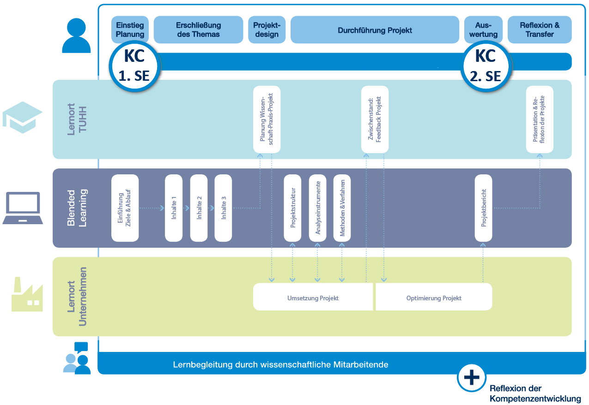
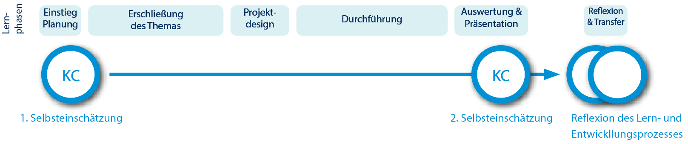

# Einsatzszenario: Reflexion des individuellen Lernprozesses & Veranstaltungsfeedback

- - -

In diesem didaktischen Einsatzszenario reflektieren die Lernenden ihren Lernprozess und den Grad der Kompetenzentwicklung anhand der Check-Auswertung und leiten Handlungsalternativen für sich selber, aber auch für die Gestaltung der Lehrveranstaltung ab. Auf Grundlage der Reflexionen der Lernenden kann die Lehrperson dann in einen zielgerichteten Austausch über anvisierte Lernergebnisse, subjektiv wahrgenommene Lernerfolge und Hürden sowie die Gestaltung der Lehrveranstaltung mit den Lernenden treten. Daraus können individuelle Förderangebote für die Lernenden abgeleitet und das Lehrangebot weiterentwickelt werden.

## Das Einsatzszenario ist für folgende Lehr-Lernkontexte im Hochschulbereich geeignet

* **Verwendungszweck:** Das Szenario eignet sich im Rahmen der Reflexion am Ende einer Lehrveranstaltung. Im Gegensatz zu "üblichen" Reflexionen oder Evaluationen, die einzig die Lehrveranstaltung in den Blick nehmen, ermöglicht das Szenario eine Verknüpfung des individuellen Lernprozesses mit anvisierten Lernergebnissen und der Gestaltung der Lehrveranstaltung. 

* **Ziel Lehrende:** Einblick in Lernprozess, begründetes Veranstaltungsfeedback, Ideen zur kompetenzorientierten Weiterentwicklung der Lehrveranstaltung.

* **Ziel Lernende:** Reflexion von Kompetenzentwicklung, Entwicklung von Handlungsalternativen im Lernprozess

* **Format:** Jede Lehrveranstaltung, jedes Weiterbildungsangebot

* **Verortung im Lehr-Lernprozess:** Beginn (Präsenz oder Online) & Ende (Präsenz)

* **Anzahl Lernende:** Studierendengruppen und Einzelpersonen

* **Anzahl Selbsteinschätzungen:** 2

* **Anzahl Fremdeinschätzungen:** 0 bzw. individuell nach Bedarf

* **Zeitumfang:** Bei Studierendengruppen: Auftaktveranstaltung ca. 30 Min., Abschlussveranstaltung ca. 45 Min.

## Ausführliche Beschreibung des didaktischen Einsatzszenarios

### Vorbereitung des Einsatzszenarios
Im ersten Schritt ist es Aufgabe der Lehrenden bzw. Lernbegleitenden, die Funktionalitäten des ContinuING Kompetenz-Checks selber kennenzulernen. Dies ist bedeutsam, um später auf Nachfragen der Lernenden Hilfestellung in der Arbeit mit dem ContinuING Kompetenz-Check leisten zu können.

Im zweiten Schritt legt die Lehrperson bzw. die Lernbegleitung einen Check mit dem Namen und den anvisierten Lernergebnissen des Studienformats im Tool an. Je nach Studienformat und Struktur der Lehrveranstaltung kann es sinnvoll sein, unterschiedliche Lern- bzw. Arbeitsphasen (wie Planung, Durchführung, Abschluss etc.) anzulegen und die Lernergebnisse diesen zuzuordnen. Abschließend notiert die Lehrperson bzw. die Lernbegleitung die spezifische Checknummer, um den erstellten Check mit den Lernenden teilen zu können. Dies bedeutet, dass die Lernenden den Check in ihr Kompetenz-Check Profil durch Eingabe der Nummer importieren können.

Je nach Studienformat (reine Präsenzveranstaltung oder Blended Learning) erfolgt die Vorstellung der Methode der Selbsteinschätzung zur Reflexion des Lern- und Kompetenzentwicklungsprozesses und des ContinuING Kompetenz-Check in der Einführungsveranstaltung. Bei Präsenzveranstaltungen sollte die Lehrperson ca. 15 Minuten zur Erläuterung der Methode, ihres Mehrwertes und für die Vorstellung der Arbeit mit dem ContinuING Kompetenz-Check einplanen. Weitere 15 Minuten sollten zur Durchführung der 1. Selbsteinschätzung durch die Lernenden eingeplant werden. Evtl. ist es im Vorfeld sinnvoll, die Studierenden zu bitten, Laptops zur Veranstaltung mitzubringen. 

In Blended Learning-Szenarien muss die Methode, ihr Mehrwert und die Arbeit mit dem ContinuING Kompetenz-Check in der Lernplattform verständlich beschrieben werden. Dies umfasst ebenfalls die Checknummer. 

### Durchführung der 1. Selbsteinschätzung: Erste Veranstaltung (Präsenz oder Online, ca. 30 Min.)

Der ContinuING Kompetenz-Check wird in der ersten Veranstaltung vorgestellt, die Checknummer wird z.B. an ein Whiteboard geschrieben. Die Lernenden registrieren sich und führen die erste Selbsteinschätzung in der Veranstaltung durch. Sie werden gebeten, pro Lernergebnis und Einschätzung im Kommentarbereich festzuhalten, warum sie sich so einschätzen (z.B. aufgrund von Vorerfahrungen). Diese Kommentare helfen den Lernenden am Ende des Lernprozesses, um nachvollziehen zu können, warum sie sich zu Beginn wie eingeschätzt haben.

Erfahrungen haben gezeigt, dass vor der ersten Selbsteinschätzung eine inhaltliche Auseinandersetzung mit dem Studienformat (Lernergebnisse, Inhalte, Ablauf, Prüfung) wichtig für die Lernenden ist, um das Ziel des ContinuING Kompetenz-Check nachvollziehen und die formulierten Kompetenzbeschreibungen verstehen zu können. Die Kompetenzbeschreibungen im Check sind mit den Lernergebnissen des Studienformats identisch.

### Durchführung der 2. Selbsteinschätzung: Vor der Abschlussveranstaltung (Online)

Die zweite Selbsteinschätzung führen die Lernenden vor der Abschlussveranstaltung des Studienformats online durch. Auch hier sind sie angehalten, ihre Einschätzungen zu kommentieren. Für die letzte Veranstaltung bringen die Lernenden ihre Check-Auswertungen digital oder ausgedruckt mit.

### Reflexion der Kompetenzentwicklung und Feedback: Abschlussveranstaltung bzw. Auswertungs- und Reflexionsgespräch (ca. 45 Min.)

Die folgende Aufgabenstellung bezieht sich auf eine Studierendengruppe, kann aber auch auf Einzelpersonen übertragen werden.

**a) Arbeitsauftrag Reflexions-Teams**

Findet euch in 2er-Teams zusammen.

Schaut euch gemeinsam eure Check-Auswertung an und identifiziert Auffälligkeiten, z. B. eine sehr positive Veränderung bzw. starker Kompetenzzuwachs oder keine Veränderung bzw. sehr geringer Kompetenzzuwachs.
* Diskutiert, woran es liegen könnte, dass kein bzw. wenig Kompetenzzuwachs erfolgt ist
* Haltet die von euch identifizierten Auffälligkeiten und Begründungen stichpunktartig fest

**b) Arbeitsauftrag Reflexion des Lernprozesses**

Schaut jetzt zurück auf euren Lernprozess und überlegt:
* Was ihr gebraucht hättet, um einen größeren Lern- oder Kompetenzzuwachs zu erreichen (z. B. spezifische Inhalte oder Methoden)
* Welche Rahmenbedingungen wären hilfreich gewesen (z. B. mehr Zeit, Tutorium)
* Was hättet ihr selber tun können, um euren Lernprozess/Kompetenzzuwachs erfolgreicher zu gestalten? 

Schreibt eure Überlegungen auf Metaplankarten und ordnet sie an der Metaplanwand an, clustert falls möglich. Eure Ergebnisse werden anschließend im Plenum besprochen.

### Varianten des Einsatzszenarios

* Üben des konstruktiven Austausches zu Stärken und Entwicklungsmöglichkeiten in Reflexions-Teams: Evtl. kann es erforderlich sein, einen geschützten Raum zur Reflexion über den eigenen Lernprozess, die Erfolge und Herausforderungen zu bieten. Dafür könnten die Reflexions-Teams schon mit Beginn der Lehrveranstaltung zusammenarbeiten, sich gegenseitig fremdeinschätzen und dadurch den konstruktiven Umgang miteinander üben.
* Besprechung der Ergebnisse im Rahmen von Lernstandsgesprächen: Anstelle der Besprechung der Ergebnisse im Plenum, könnten die Ergebnisse der Reflexions-Teams dann im Rahmen von Lernstandsgesprächen einzeln mit den Lehrpersonen bzw. Lernbegleitenden besprochen werden.
* Den Selbsteinschätzungen können Fremdeinschätzung von Peers, der Lernbegleitung oder weiteren Akteuren gegenüber gestellt werden.
* Die Lernenden formulieren eigene Lernergebnisse, die sie Im Rahmen des Lehr-Lernprozesses erreichen möchten.
