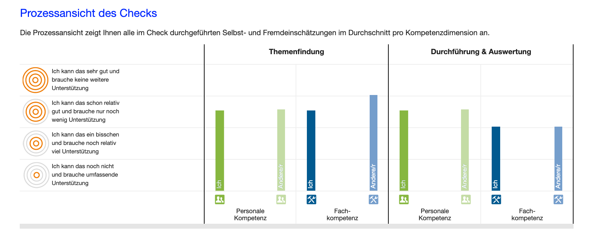
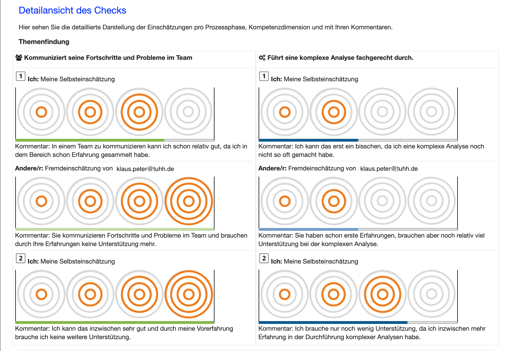

# Auswertung des Checks
- - -
Sie haben den Check beendet und somit alle Selbst- und Fremdeinschätzungen abgeschlossen. Auf dieser Seite sehen Sie die Auswertung der erfassten Daten zum durchgeführten Arbeitsauftrag. 

## Was ist die Check-Auswertung?
Diese Seite zeigt die Ergebnisse des Checks aus zwei Perspektiven:
* **Die Prozessansicht des Checks** visualisiert die Summe aller Selbst- und Fremdeinschätzungen pro Check-Phase und Kompetenzdimension (Fach- und Personale Kompetenz).

Hier erkennen Sie bereits auf einen Blick erste Unterschiede und Gemeinsamkeiten der Selbst- sowie Fremdeinschätzungen.

* **Die Detaillansicht eines Checks** zeigt die einzelnen Selbst- und Fremdeinschätzungen pro Check-Phase mit Kommentaren an. 

Nutzen Sie sowohl die Prozessansicht, als auch die Detailansicht für das **Auswertungsgespräch**.

## Wie und mit wem führe ich das Auswertungsgespräch?

Bitten Sie die Person(en), die Sie fremdeingeschätzt hat/haben, zu einem Gespräch, um gemeinsam die Ergebnisse des ContinuING Kompetenz-Check zu besprechen. 
Im Auswertungsgespräch besprechen Sie zunächst auf Grundlage der Prozessansicht und der Detailansicht mit Ihren Check-Partnern/innen (z. B. Fremdeinschätzer) den durchgeführten Prozess, aufgetretene Herausforderungen und Erfolge.
Dieser offene und ehrliche Dialog zielt darauf ab, Entwicklungspotenziale zu identifizieren und den Kompetenzentwicklungsprozess der Selbsteinschätzungperson gemeinsam zu gestalten.
Um dieses Ziel zu erreichen, tauschen Sie sich mit den (Check-Partnern, oder dem Check-Partner bzw. der Check-Partnerin ?kürzer?) über Ihre Wahrnehmungen und Beobachtungen während der Check-Durchführung aus und besprechen die Begründungen, die zu den jeweiligen Kompetenzeinschätzungen geführt haben. 

Das Ergebnis des Auswertungsgespräches sind Ihre Entwicklungsziele bzw. die Entwicklungsziele des Selbsteinschätzers bzw. der Selbsteinschätzerin, die Sie im **Arbeitsblatt Zielvereinbarung** festhalten.

## Diese Materialien unterstützen Sie in der Durchführung des Auswertungsgespräches:
* **Der Leitfaden zur Durchführung des Auswertungsgespräches** gibt Ihnen nützliche Hinweise und Anregungen zum Gespräch über die Ergebnisse des ContinuING Kompetenz-Checks: <a href="https://fizban05.rz.tu-harburg.de/itbh/kompetenzcheck-hilfe/media/Hilfetext_Auswertungsgespraech_Leitfaden.pdf" target="_blank">Leitfaden zur Durchführung des Auswertungsgesprächs</a>
* **Das Arbeitsblatt Zielvereinbarung** bietet Ihnen die Möglichkeit, Ihre Entwicklungsziele, den Entwicklungszeitraum sowie Methoden oder Förderangebote als Vereinbarungen zwischen Ihnen und weiteren Personen festzuhalten: <a href="https://fizban05.rz.tu-harburg.de/itbh/kompetenzcheck-hilfe/media/Arbeitsblatt_Zielformulierung.pdf" target="_blank">Arbeitsblatt Zielvereinbarung</a>

