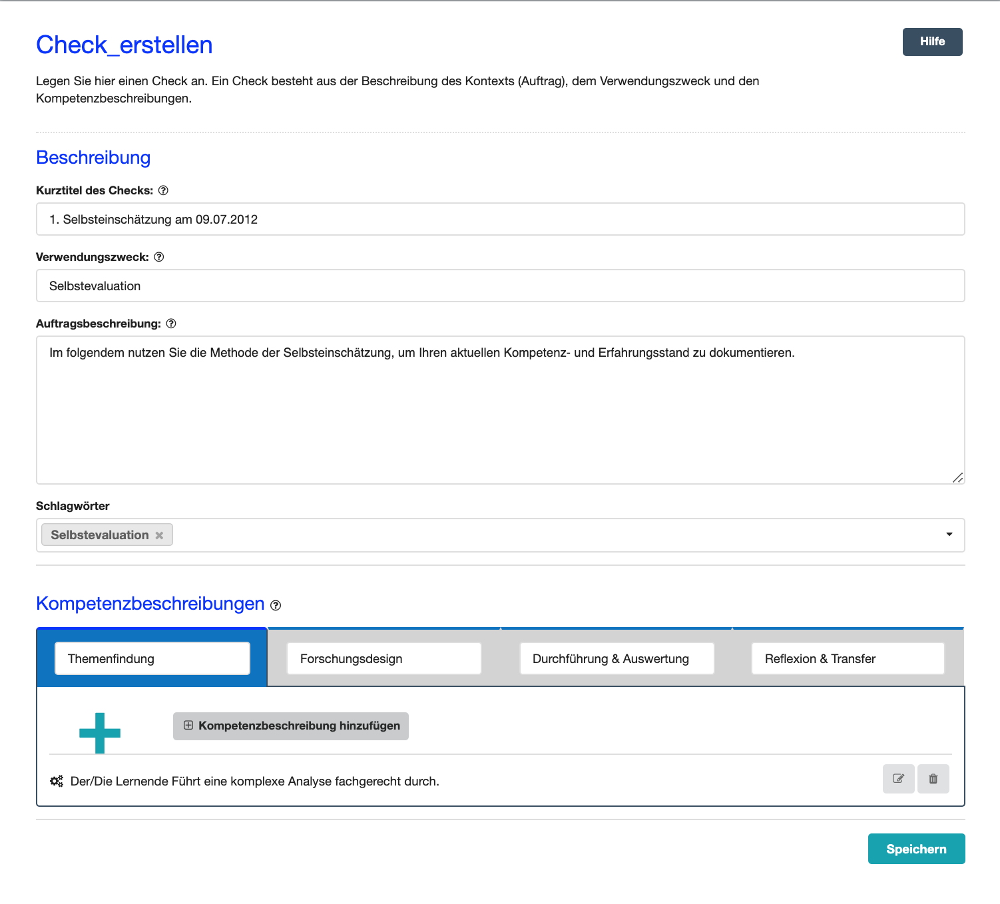
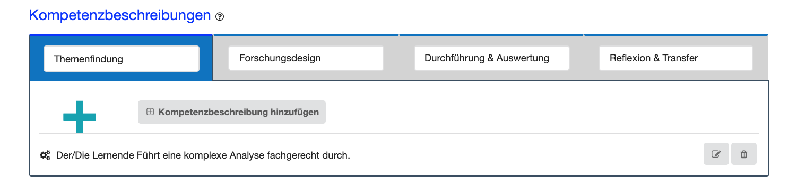
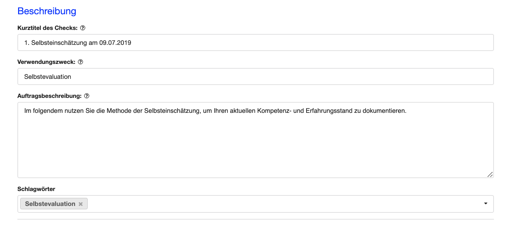
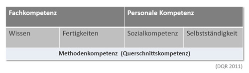
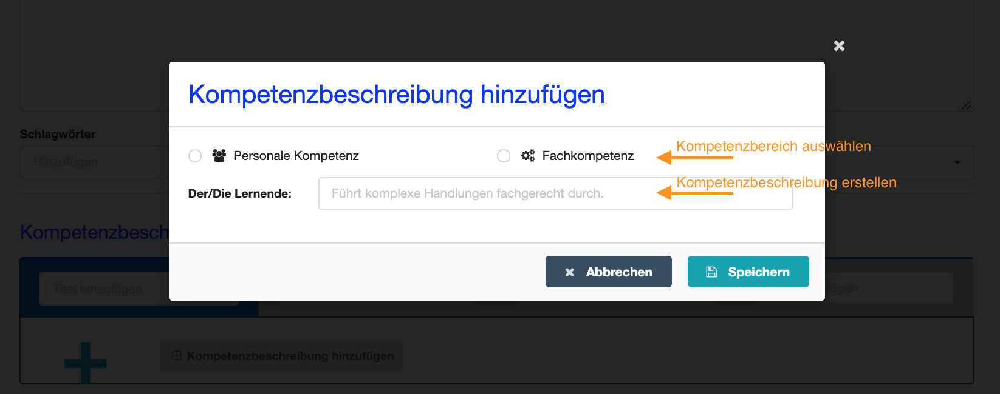

# Check anlegen
- - -
Auf dieser Seite erstellen Sie einen neuen Check.

## Was ist ein Check?
Ein Check stellt im Kompetenz-Check die Grundlage für einen Dialog über das Kompetenzvermögen einer Person bzw. des Selbsteinschätzers bzw. der Selbsteinschätzerin da.
Dabei bezieht sich ein Check immer auf eine spezifische Handlungssituation, z. B. die Bearbeitung eines Arbeits- oder Forschungsauftrages, und beinhaltet die in der 
jeweiligen Situation benötigten Kompetenzen. 
Die Durchführung eines Checks erfolgt idealerweise prozessorientiert, also paralell zur Bearbeitung des Arbeits- oder Forschungsauftrages. Daher ist ein Check immer durch vier Phasen 
strukturiert, die sich an typischen Arbeits- oder Forschungsprozessen orientieren:

 
* **Die Auftragsanalyse**: In der Auftragsanalyse werden die Rahmenbedingungen, Anforderungen und Zielsetzungen des Arbeits- oder Forschungsauftrages geklärt 
* **Die Planungsphase**: In der Planungsphase geht es darum, den Auftrag z. B. durch die Bereitstellung von Materialien, Instrumenten und Werkzeugen vorzubereiten bzw. geeignete Methoden und Verfahren passend zur Zielsetzung und Forschungsfrage auszuwählen.
* **Die Durchführungsphase**: In dieser Phase wird der Auftrag praktisch umgesetzt, indem z. B. ein Produkt erstellt, Daten erhoben oder Experimente durchgeführt werden.
* ** Der Abschluss**: In der Abschlussphase geht es darum das erreichte Ergebnis mit der Ziel- und Fragestellung abzugleichen bzw. das erstellte Produkt dem Auftraggeber zu übergeben und den durchlaufenen Prozess zu reflektieren. 

Jeder Check-Phase können Kompetenzbeschreibungen hinzugefügt werden, die für die Bearbeitung des Auftrages 

Neben einem Checktitel,
einen Verwendungszweck und einer Auftragsbeschreibung können Sie dem
Check noch Schlagwörter hinzufügen. Wenn Sie für den Check z. B. das Schlagwort "Vorlage" vergeben, können Sie den Check unter diesem Schlagwort 
immer wiederfinden und erneut einsetzen.

Ein 

## Wie erstelle ich einen Check?

Neben einem Checktitel,
einen Verwendungszweck und einer Auftragsbeschreibung können Sie dem
Check noch Schlagwörter hinzufügen. Wenn Sie für den Check z. B. das Schlagwort "Vorlage" vergeben, können Sie den Check unter diesem Schlagwort 
immer wiederfinden und erneut einsetzen.

Im nächsten Schritt fügen Sie den Check-Phasen mittels des Plus-Buttons Kompetenzbeschreibungen hinzu. 

Dabei müssen Sie nicht allen Phasen Kompetenzbeschreibungen 
hinzufügen. Je nach Zielsetzung und Szenario entscheiden Sie, worauf Sie Ihren Fokus setzen möchten.

Kompetenzbeschreibungen können dann den Dimensionen Personale Kompetenz und Fachkompetenz zugeordnet werden (siehe hierzu den Qualifikationsrahmen für Lebenslanges Lernen http://www.dqr.de/index.php)

Zum Erstellen eines Kompetenz-Checks gehört das Hinzufügen von
Kompetenzbeschreibungen. Hierzu wählen Sie zuerst die
Auftragsphase aus, zu der Sie eine Kompetenzbeschreibung hinzufügen
möchten. Anschließend formulieren Sie die Kompetenzbeschreibung und
ordnen diese dem entsprechenden Kompetenzbereich zu.

Sie können eine Kompetenzbeschreibung dem Bereich „Fachkompetenz“ oder
„Personale Kompetenz“ zuordnen. Unter Fachkompetenz sind das Wissen und
die Fertigkeiten, die zur Bearbeitung des Arbeitsauftrags notwendig
sind, zu verstehen. Die Personale Kompetenz gliedert sich in
„Sozialkompetenz“ (u. a. Zusammenarbeit und Kommunikation mit Anderen) und
"Selbstständigkeit" (u. a. Zeit- und Aufgabenmanagement, Bereitschaft zum Lernen, Fähigkeit und Bereitschaft zum Feedback Geben und Nehmen) auf.

## Wie formuliere ich eine Kompetenzbeschreibung?
Die Kompetenzbeschreibung sollte einen konkreten Bezug zum Arbeitsauftrag haben
und möglichst genau die auszuführende, bzw. zu beobachtende Handlung
beschreiben. Zudem sollte eine Kompetenzbeschreibung immer in der 3. Person singular formuliert werden.  

  **Beispiele:** 
  
* Personale Kompetenz: Der Lernende erarbeitet die Planung des Arbeitsauftrags
kooperativ in der Gruppe und stimmt sich ab.

* Fachkompetenz: Der Lernende erstellt einen Projektplan fachgerecht.

## Wie geht es nach dem Anlegen des Checks weiter?
Sobald Sie Ihren Check gespeichert haben, gelangen Sie wieder auf die Seite **Dashboard**. 
Rechts neben dem Check werden Ihnen nun weitere **Aktionsmöglichkeiten** angeboten:
* Eine Selbsteinschätzung durchführen: Wählen Sie auf dem Dashboard die Aktionsmöglichkeit **Selbsteinschätzung durchführen**.
* Den Check einer weiteren Person zuweisen: Wählen Sie auf dem Dashboard die Aktionsmöglichkeit **Check zuweisen**.

