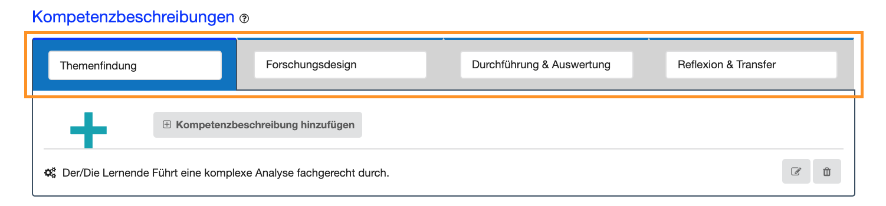

# Check erstellen
- - -
Auf dieser Seite erstellen Sie einen neuen Check. Sie können einen Check zur Selbstevaluation oder für weitere Personen erstellen, welche Sie dann in die folgenden Schritte miteinbeziehen sollten. Die Durchführung eines Checks erfolgt idealerweise parallel zur Bearbeitung des Arbeits- oder Forschungsauftrages. 

## Wie erstelle ich einen Check?

### 1. Schritt: Arbeits- bzw. Forschungsauftrag beschreiben
Um ein gemeinsames Verständnis aller Beteiligten über den Check zu erreichen, wird die zugrunde liegende Handlungssituation ausführlich in den Punkten Kurztitel, 
Auftragsbeschreibung und Verwendungszweck beschrieben: 

**Der Kurztitel des Checks:** Zunächst geben Sie dem Check einen prägnanten und kurzen Namen, der sich auf den durchzuführenden Arbeits- oder Forschungsauftrag bezieht.

**Der Verwendungszweck:** Ein Check kann mit unterschiedlichen Zielsetzungen durchgeführt werden, z. B. zur Selbstevaluation, zur Prüfungsvorbereitung, als 
Assessment, um Feedback einzuholen etc. Formulieren Sie deutlich, mit welcher Zielsetzung der Kompetenz-Check durchgeführt wird.

**Die Auftragsbeschreibung:** Hier wird die Situation beschrieben, in der gehandelt werden soll, z. B. die Bearbeitung eines Arbeits- oder Forschungsauftrages. 
Eine detaillierte Auftragsbeschreibung unterstützt alle Check-Beteiligten bei der Einschätzung von Stärken und Bedarfen während der 
Auftragsbearbeitung. Es muss deutlich werden in welchem Zusammenhang die Kompetenzen eingeschätzt werden sollen.

Eine Auftragsbeschreibung kann folgende Aspekte umfassen:
* Welche Rahmenbedingungen sind gegeben bzw. müssen beachtet werden?
* Mit wem wird zusammengearbeitet? 
* Welche Regeln, Normen, Vorschriften müssen beachtet werden? 
* Welche Werkzeuge, Instrumente, Methoden oder Materialien sollen eingesetzt werden?
* Gibt es Qualitätsansprüche an das Arbeitsprodukt/ die Dienstleistung bzw. das Forschungsprodukt? 

**Schlagwörter:** Fügen Sie dem Check Schlagwörter hinzu, um sie später sortieren und filtern zu können. Unter dem Menüpunkt Schlagwörter können Sie Schlagwörter hinzufügen, verwalten und bearbeiten.

### 2. Schritt: Strukturierung der Kompetenzbeschreibungen
Sie können die Kompetenzen bis zu vier Phasen (Reitern) zuordnen, um Lern- bzw. Arbeitsprozesse abzubilden oder das Kompetenzprofil zu gliedern. 

Wenn Sie einen Lernprozess im Sinne des Forschenden Lernens abbilden möchten, können Sie den Check wie folgt strukturieren:

* **Themenfindung:** In dieser Phase erfolgt die Themenfindung & -aushandlung, je nach in der Praxis erfahrenen Problemstellungen.
* **Forschungsdesign:** Die Formulierung von Forschungsfragen bzw. Hypothesen leitet über zur Gestaltung eines entsprechenden Forschungsdesigns.
* **Durchführung & Auswertung:** In dieser Phase erfolgt die Datenerhebung und -auswertung.
* **Reflexion & Transfer:** Die Reflexion gewonnener Erkenntnisse und ihr Transfer in die zu untersuchende Praxis beschließen den Lernprozess.

Wenn Sie ein Kompetenzprofil anlegen möchten, können Sie bspw. die Dimensionen des Deutschen Qualifikationsrahmens für Lebenslanges Lernen (DQR) nutzen und die Kompetenzbeschreibungen diesen zuordnen: Wissen, Fertigkeiten, Sozialkompetenz, Selbständigkeit.

Sie müssen **nicht** allen Phasen Kompetenzbeschreibungen hinzufügen. Je nach Zielsetzung und Szenario entscheiden Sie, worauf Sie Ihren Fokus setzen möchten!

### 3. Schritt: Kompetenzbeschreibungen den Phasen zuordnen
Im nächsten Schritt fügen Sie den einzelnen Phasen Kompetenzbeschreibungen hinzu, indem Sie den **Plus-Button** oder den **Kompetenzbeschreibung hinzufügen-Button** in einer Check-Phase anklicken:

Jede Kompetenzbeschreibung muss einem Kompetenzbereich zugeordnet werden. Grundsätzlich wird zwischen **Fachkompetenzen (Wissen und Fertigkeiten)** und **Personalen Kompetenzen (Sozialkompetenz und Selbständigkeit)** unterschieden. 

Bei der Erstellung eines Checks ist es sinnvoll, beide Kompetenzbereiche zu beachten, um die Handlungskompetenz 
der Selbstevaluation bestmöglich erfassen zu können.
Während der Check-Durchführung dienen diese Kompetenzbeschreibungen dann als Grundlage zur Einschätzung des eigenen Könnens (Selbsteinschätzung) und zur Beobachtung des Könnens einer anderen Person (Fremdeinschätzung). 

#### Wie formuliere ich eine Kompetenzbeschreibung?
Die Kompetenzbeschreibung sollte einen konkreten Bezug zum bereits formulierten Lern- oder Arbeitsprozess haben und möglichst genau die auszuführende, bzw. zu beobachtende Handlung beschreiben. 
Eine Kompetenzbeschreibung muss immer in der 3. Person singular und in ganzen Sätzen unter Verwendung beobachtbarer Verben (Operatoren) formuliert werden. <a href="https://fizban05.rz.tu-harburg.de/itbh/kompetenzcheck-hilfe/media/Verben_fuer_Kompetenzbeschreibung.pdf" target="_blank">Beispielverben für die Kompetenzbeschreibung</a>

**Formulierung einer Kompetenzbeschreibung:**

Der Lerner + Verb (Operator) + Inhalt/Bezug der Handlung + Situation + Kontext der Handlung +
ggf. spezifisches Kriterium

  **Beispiele:** 
  
* Personale Kompetenz: Der Lernende erarbeitet die Planung des Arbeitsauftrags
kooperativ in der Gruppe und stimmt sich ab.

* Fachkompetenz: Der Lernende erstellt einen Projektplan fachgerecht.

## Wie geht es nach dem Anlegen des Checks weiter?
Sobald Sie Ihren Check gespeichert haben, gelangen Sie wieder auf die Seite **Dashboard**. 
Rechts neben dem Check werden Ihnen nun weitere **Aktionsmöglichkeiten** angeboten:
* Eine Selbsteinschätzung durchführen: Wählen Sie auf dem Dashboard die Aktionsmöglichkeit **Selbsteinschätzung durchführen**.
* Den Check einer weiteren Person zuweisen: Wählen Sie auf dem Dashboard die Aktionsmöglichkeit **Check zuweisen**.

