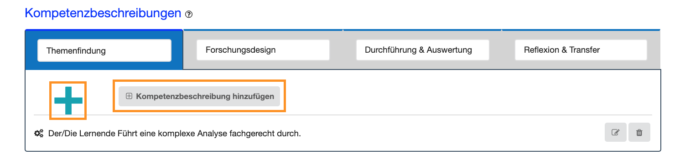
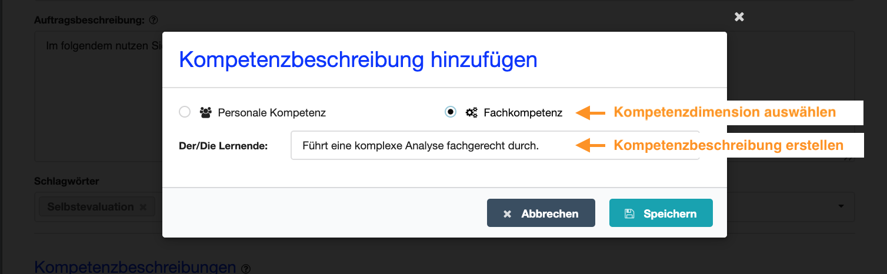

# Check anlegen
- - -
Auf dieser Seite erstellen Sie einen neuen Check.

## Was ist ein Check?
Ein Check stellt die Grundlage für einen Dialog über das Kompetenzvermögen einer Person, also des Selbsteinschätzers bzw. der Selbsteinschätzerin dar.

### Arbeits- bzw. Forschungsauftrag
Dabei bezieht sich ein Check immer auf eine **spezifische Handlungssituation**, z. B. die Bearbeitung eines Arbeits- oder Forschungsauftrages, und beinhaltet die in der 
jeweiligen Situation benötigten **Handlungskompetenzen**. Zusätzlich zur Beschreibung der Situation können einem Check Schlagwörter hinzugefügt werden.

Die Durchführung eines Checks erfolgt idealerweise prozessorientiert, also paralell zur Bearbeitung des Arbeits- oder Forschungsauftrages. Daher ist ein Check immer durch vier Phasen 
strukturiert, die sich an typischen Arbeits- oder Forschungsprozessen orientieren:

 
* **Die Auftragsanalyse:** In der Auftragsanalyse werden die Rahmenbedingungen, Anforderungen und Zielsetzungen des Arbeits- oder Forschungsauftrages geklärt. 
* **Die Planungsphase:** In der Planungsphase geht es darum, den Auftrag z. B. durch die Bereitstellung von Materialien, Instrumenten und Werkzeugen vorzubereiten bzw. geeignete Methoden und Verfahren passend zur Zielsetzung und Forschungsfrage auszuwählen.
* **Die Durchführungsphase:** In dieser Phase wird der Auftrag praktisch umgesetzt, indem z. B. ein Produkt erstellt, Daten erhoben oder Experimente durchgeführt werden.
* **Der Abschluss:** In der Abschlussphase geht es darum, das erreichte Ergebnis mit der Ziel- und Fragestellung abzugleichen bzw. das erstellte Produkt dem Auftraggeber zu übergeben und den durchlaufenen Prozess zu reflektieren. 

### Kompetenzbeschreibungen
Jeder Check-Phase können Sie ausgewählte Kompetenzbeschreibungen hinzugefügen: Grundsätzlich wird zwischen **Fachkompetenzen (Wissen und Fertigkeiten)** und **Personalen Kompetenzen (Sozialkompetenz und Selbständigkeit)** unterschieden. Bei der Erstellung eines Checks ist es sinnvoll, beide Kompetenzbereiche zu beachten, um die Handlungskompetenz 
des Selbsteinschätzers bzw. der Selbsteinschätzerin bestmöglich erfassen zu können.
Während der Check-Durchführung dienen diese Kompetenzbeschreibungen dann als Grundlage zur Einschätzung des eigenen Könnens (aus Sicht des Selbsteinschätzers bzw. 
der Selbsteinschätzerin) und zur Beobachtung des Könnens einer anderen Person (aus Sicht des Fremdeinschätzers bzw. der Fremdeinschätzerin). 

Ein Check kann alleine, mit einer weiteren Person, oder auch mit einer Gruppe durchgeführt werden.
Mit Abschluss aller gewünschten Selbst- und Fremdeinschätzungen können der Check beendet und die erfassten Daten ausgewertet werden. 
Diese Check-Auswertung dient dann als Grundlage zur Besprechung und Reflexion des Arbeits- bzw. Forschungsprozesses.

## Wie erstelle ich einen Check?

Sie können einen Check zur Selbstevaluation oder für weitere Personen, Check-Partner bzw. Check-Partnerinnen genannt, erstellen. 
Wenn Sie einen Check für eine oder mehrere Check-Partner und Check-Partnerinnen anlegen wollen ist es sinnvoll, diese in die folgenden Schritte miteinzubeziehen.

### 1. Schritt: Arbeits- bzw. Forschungsauftrag beschreiben
Um ein gemeinsames Verständnis aller Beteiligten über den Check zu erreichen, wird die zugrunde liegende Handlungssituation ausführlich in den Punkten Kurztitel, 
Auftragsbeschreibung und Verwendungszweck beschrieben: 

**Der Kurztitel des Checks:** Zunächst geben Sie dem Check einen prägnanten Namen, der sich auf den durchzuführenden Arbeits- oder Forschungsauftrag bezieht. 
Der Titel sollte kurz und für weitere Personen nachvollziehbar sein.

**Der Verwendungszweck:** Ein Check kann mit unterschiedlichen Zielsetzungen durchgeführt werden, z. B. zur Selbstevaluation, zur Prüfungsvorbereitung, als 
Assesment, um Feedback einzuholen etc. Formulieren Sie den Verwendungszweck treffend. Es sollte deutlich werden, mit welcher Zielsetzung der Kompetenzcheck 
durchgeführt wird.

**Die Auftragsbeschreibung:** Hier wird die Situation beschrieben, in der gehandelt werden soll, z. B. die Bearbeitung eines Arbeits- oder Forschungsauftrages. 
Eine detaillierte Auftragsbeschreibung unterstützt alle Check-Partner und Check-Partnerinnen bei der Einschätzung von Stärkung und Bedarfen während der 
Auftragsbearbeitung. Es muss deutlich werden, in welchem Zusammenhang die Kompetenzbeschreibungen geckeckt werden sollen.

Eine Auftragsbeschreibung kann folgende Aspekte umfassen:
* Welche Rahmenbedingungen sind gegeben bzw. müssen beachtet werden?
* Mit wem wird zusammengearbeitet? 
* Welche Regeln, Normen, Vorschriften müssen beachtet werden? 
* Welche Werkzeuge, Instrumente, Methoden oder Materialien sollen eingesetzt werden?
* Gibt es Qualitätsansprüche an das Arbeitsprodukt/-dienstleistung bzw. das Forschungsprodukt? 

**Schlagwörter:** Fügen Sie dem Check Schlagwörter hinzu, um Ihre Checks später sortieren und filtern zu können. Unter dem **Menüpunkt Schlagwörter** 
können Sie Ihre Schlagwörter verwalten, bearbeiten und neue hinzufügen.

Im nächsten Schritt fügen Sie den Check-Phasen mittels des Plus-Buttons Kompetenzbeschreibungen hinzu. 

Dabei müssen Sie nicht allen Phasen Kompetenzbeschreibungen 
hinzufügen. Je nach Zielsetzung und Szenario entscheiden Sie, worauf Sie Ihren Fokus setzen möchten.

Kompetenzbeschreibungen können dann den Dimensionen Personale Kompetenz und Fachkompetenz zugeordnet werden (siehe hierzu den Qualifikationsrahmen für Lebenslanges Lernen http://www.dqr.de/index.php)

Zum Erstellen eines Kompetenz-Checks gehört das Hinzufügen von
Kompetenzbeschreibungen. Hierzu wählen Sie zuerst die
Auftragsphase aus, zu der Sie eine Kompetenzbeschreibung hinzufügen
möchten. Anschließend formulieren Sie die Kompetenzbeschreibung und
ordnen diese dem entsprechenden Kompetenzbereich zu.

Sie können eine Kompetenzbeschreibung dem Bereich „Fachkompetenz“ oder
„Personale Kompetenz“ zuordnen. Unter Fachkompetenz sind das Wissen und
die Fertigkeiten, die zur Bearbeitung des Arbeitsauftrags notwendig
sind, zu verstehen. Die Personale Kompetenz gliedert sich in
„Sozialkompetenz“ (u. a. Zusammenarbeit und Kommunikation mit Anderen) und
"Selbstständigkeit" (u. a. Zeit- und Aufgabenmanagement, Bereitschaft zum Lernen, Fähigkeit und Bereitschaft zum Feedback Geben und Nehmen) auf.

## Wie formuliere ich eine Kompetenzbeschreibung?
Die Kompetenzbeschreibung sollte einen konkreten Bezug zum Arbeitsauftrag haben
und möglichst genau die auszuführende, bzw. zu beobachtende Handlung
beschreiben. Zudem sollte eine Kompetenzbeschreibung immer in der 3. Person singular formuliert werden.  

  **Beispiele:** 
  
* Personale Kompetenz: Der Lernende erarbeitet die Planung des Arbeitsauftrags
kooperativ in der Gruppe und stimmt sich ab.

* Fachkompetenz: Der Lernende erstellt einen Projektplan fachgerecht.

## Wie geht es nach dem Anlegen des Checks weiter?
Sobald Sie Ihren Check gespeichert haben, gelangen Sie wieder auf die Seite **Dashboard**. 
Rechts neben dem Check werden Ihnen nun weitere **Aktionsmöglichkeiten** angeboten:
* Eine Selbsteinschätzung durchführen: Wählen Sie auf dem Dashboard die Aktionsmöglichkeit **Selbsteinschätzung durchführen**.
* Den Check einer weiteren Person zuweisen: Wählen Sie auf dem Dashboard die Aktionsmöglichkeit **Check zuweisen**.

