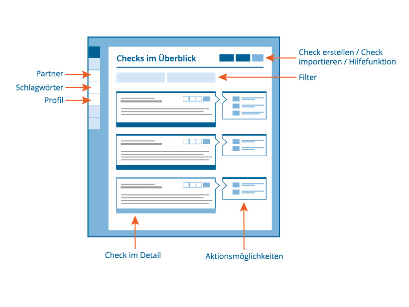

# Dashboard

Hier werden Dir Deine offenen und abgeschlossenen Kompetenzchecks
angezeigt. Zudem hast Du hier die Möglichkeit einen neuen Kompetenzcheck
zu erstellen oder einen Kompetenzcheck zu importieren.

Zu jedem Kompetenzcheck werden Dir Aktionsmöglichkeiten, entsprechend
dem aktuellen Status des Kompetenzchecks, angeboten. Weiterhin kannst Du
hier die Kompetenzchecks u. a. bearbeiten oder löschen. Um die Anzeige
der Kompetenzchecks zu begrenzen, stehen Dir verschiedene
Filtermöglichkeiten zur Verfügung.

