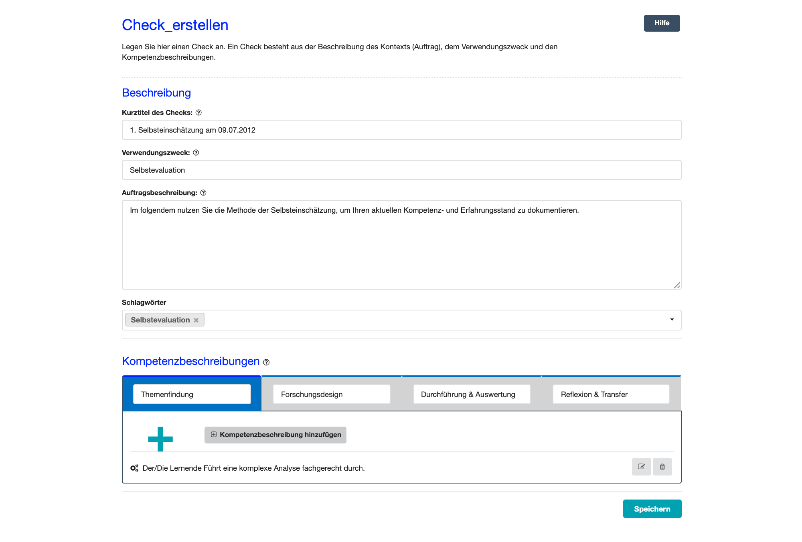

# Checks im Überblick
- - - 
Auf dieser Seite erstellen und verwalten Sie Ihre Checks.

## Was ist ein Check?

Ein Check stellt die Grundlage für einen Dialog über das Kompetenzvermögen einer Person, also des Selbsteinschätzers bzw. der Selbsteinschätzerin dar. Die Durchführung eines Checks erfolgt idealerweise prozessorientiert, also parallel zur Bearbeitung des Arbeits- oder Forschungsauftrages.

Ein Check kann alleine, mit einer weiteren Person, oder auch mit einer Gruppe durchgeführt werden.
Mit Abschluss aller gewünschten Selbst- und Fremdeinschätzungen können der Check beendet und die erfassten Daten ausgewertet werden. 
Diese Check-Auswertung dient dann als Grundlage zur Besprechung und Reflexion des Arbeits- bzw. Forschungsprozesses.

Dabei bezieht sich ein Check immer auf eine **spezifische Handlungssituation**, z. B. die Bearbeitung eines Arbeits- oder Forschungsauftrages, und beinhaltet die in der 
jeweiligen Situation benötigten **Handlungskompetenzen**.

## Was ist "Checks im Überblick"?

**Checks im Überblick** ist das Herzstück des ContinuING Kompetenz-Checks. Hier verwalten und bearbeiten Sie laufenden und bereits abgeschlossenen Checks und führen alle zentralen Aktionen durch.

**Checks im Überblick** gliedert sich in drei Bereiche (siehe Bild unten): 

* **Oben rechts**: Hier können Sie einen **neuen Check erstellen** oder einen **Check importieren**.
* **Checks im Detail**: Hier sehen Sie alle laufenden und auch abgeschlossenen Checks.
* **Aktionsmöglichkeiten**: Diese zeigen pro Check an, was Sie nun tun können und was schon geschehen ist.

## Darstellung eines Checks
Auf der rechten Seite werden Ihnen zu jedem Check und je nach Status der Check-Durchführung unterschiedliche **Aktionsmöglichkeiten** angeboten. 
So erkennen Sie immer auf einen Blick den aktuellen Status des Checks bzw. welche Aktionen Sie oder weitere Personen des Checks bereits durchgeführt haben. Ein Check kann nur bearbeitet werden, sofern der Check noch **nicht** durchgeführt wurde.

## Welche Aktionsmöglichkeiten gibt es?
Um einen Check zu durchlaufen, stehen Ihnen unterschiedliche Wege bzw. Aktionsmöglichkeiten zur Verfügung. Rechts neben einem Check zeigen Ihnen die Aktionsmöglichkeiten die nächsten Schritte auf, die Sie je nach Status des Checks durchführen können, z. B. **Eine Selbsteinschätzung durchführen** oder den **Check zuweisen**.

Folgende Aktionsmöglichkeiten stehen Ihnen insgesamt zur Verfügung:
* **Check zuweisen**: Weisen Sie den von Ihnen erstellten Check einer weiteren Person zu
* **Check importieren**: Importieren Sie den Check, der Ihnen zugewiesen wurde, in Ihren Überblick oder lehnen Sie dies ab.
* **Selbsteinschätzung durchführen**: Führen Sie eine erste Selbsteinschätzung zum Check durch.
* **Jemanden zur Fremdeinschätzung einladen**: Laden Sie eine weitere Person dazu ein, Ihren Kompetenzstand einzuschätzen.
* **Eine weitere Selbsteinschätzung durchführen**: Führen Sie weitere Selbsteinschätzungen durch.
* **Eine weitere Person zur Fremdeinschätzung einladen**: Holen Sie sich eine weitere Fremdeinschätzung ein.
* **Alle Einschätzungen abschließen und Auswertung beginnen**: Beenden Sie den laufenden Check und zugehörige Fremdeinschätzungen, um das Auswertungsgespräch durchzuführen.
* **Check-Auswertung betrachten**: Nutzen Sie die Visualisierung der Check-Ergebnisse als Grundlage Ihres Auswertungsgesprächs.
* **Auswertungsgespräch geführt und Check beenden**: Löschen Sie alle personenbezogenen Daten des Checks. Der Check an sich (Arbeitsauftrag und Kompetenzbeschreibungen) bleibt bestehen.