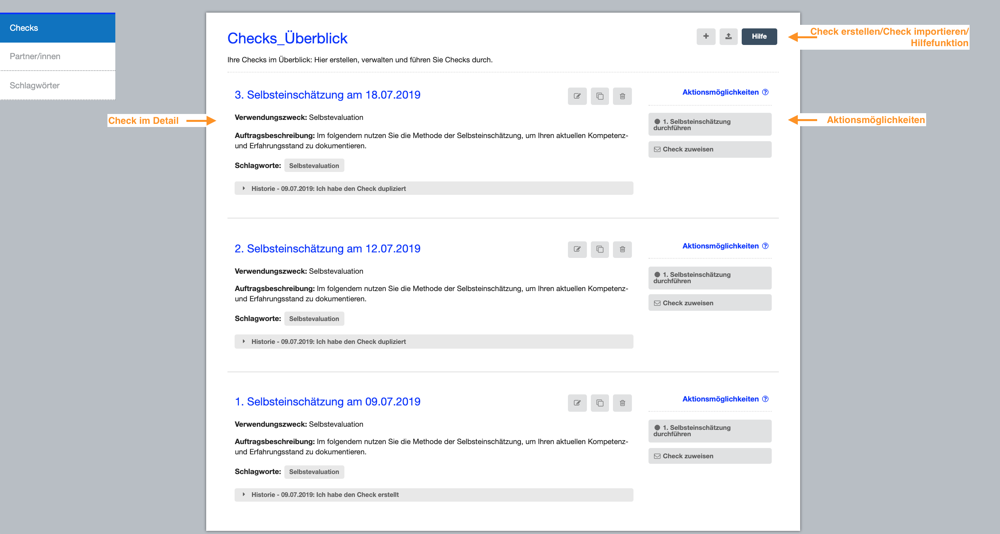

# Dashboard

Das Dashboard hilft Ihnen, Ihre Checks zu verwalten. Hier sehen Sie Ihre offenen und bereits abgeschlossenen Kompetenz-Checks. Zudem haben Sie die Möglichkeit einen neuen Check
zu erstellen oder einen Kompetenz-Check zu importieren.

Auf der rechten Seite werden Ihnen zu jedem Check und je nach Status der Check-Durchführung unterschiedliche Aktionsmöglichkeiten angeboten. Des weiteren können Sie
auf dem Dashboard bestehende Checks bearbeiten, kopieren oder löschen. Verschiedene Filtermöglichkeiten unterstützen Sie in der Organisation und Anzeige Ihrer Checks auf dem Dashboard.

