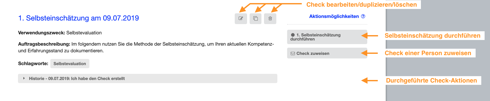

# Dashboard - Check

Hier werden Dir Informationen zum jeweiligen Kompetenzcheck angezeigt.
Neben dem Titel, dem Verwendungszweck und der Auftragsbeschreibung,
werden Dir die zugewiesenen Schlagwörter und ein Verlauf aller
bisherigen Aktionen angezeigt.

Zudem stehen Dir zu jedem Kompetenzcheck verschiedene
Interaktionsmöglichkeiten zur Verfügung. Entsprechend dem aktuellen
Status des Kompetenzchecks kannst Du diesen u. a. bearbeiten,
duplizieren oder Dir den Check bzw. das Ergebnis ansehen.

