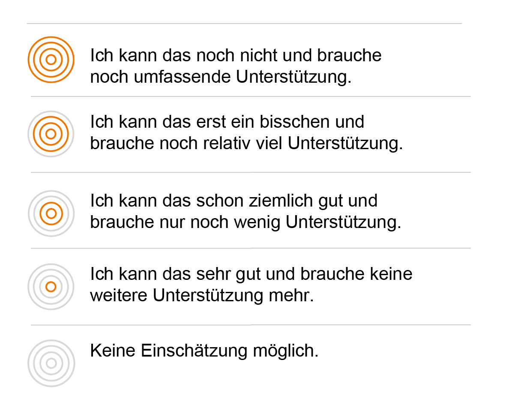

# Fremdeinschätzung
Sie wurden dazu eingeladen, eine Fremdeinschätzung abzugeben. Dies bedeutet, dass Sie einschätzen, wie weit die Person, 
die Sie zum Kompetenz-Check eingeladen hat, die beschriebenen Kompetenzen bereits entwickelt hat. 
Sie können Ihre Fremdeinschätzung entweder auf Grundlage Ihrer Wahrnehmung der Person, oder auf Basis Ihrer Beobachtungen während der 
Auftragsbearbeitung durchführen. Zur Einschätzung des Kompetenzvermögens der anderen Person stehen Ihnen vier Niveaustufen zur Verfügung, 
wenn Sie eine Kompetenz nicht einschätzen können, wählen Sie die Checkbox „Einschätzung nicht möglich“.
Die Einschätzungsstufen beziehen sich auf beobachtbare Handlungen im Rahmen der Auftragsbearbeitung, zu deren Ausführung die beschriebene Kompetenz benötigt wird. 

Eine Fremdeinschätzung trägt dann zur Kompetenzerfassung und -entwicklung bei, wenn Sie die Person bei der Auftragsdurchführung begleiten und 
regelmäßig Feedback zu durchgeführten Handlungen geben. Notieren Sie sich zu jeder Kompetenzeinschätzung einen Kommentar, um Ihre Entscheidung später nachvollziehen zu können. Im abschließenden Auswertungsgespräch auf Grundlage Ihrer Kommentare und der Gegenüberstellung von Selbst- und Fremdeinschätzung, wie die identifizierten Stärken und Entwicklungsmöglichkeiten der Person 
methodisch unterstützt werden können. 

** Sie können jetzt Folgendes tun:**

* Eine weitere Fremdeinschätzung abgeben: Informieren Sie die Person und lassen Sie sich einladen. Machen Sie sich Notizen, um im Auswertungsgespräch die unterschiedlichen Fremdeinschätzungen bestimmten Handlungen oder Arbeitsprozessphasen zuordnen zu können.
* Zum Auswertungsgespräch auffordern: Vereinbaren Sie mit der Person die Durchführung eines Auswertungsgespräch, um die Einschätzung auszuwerten.
