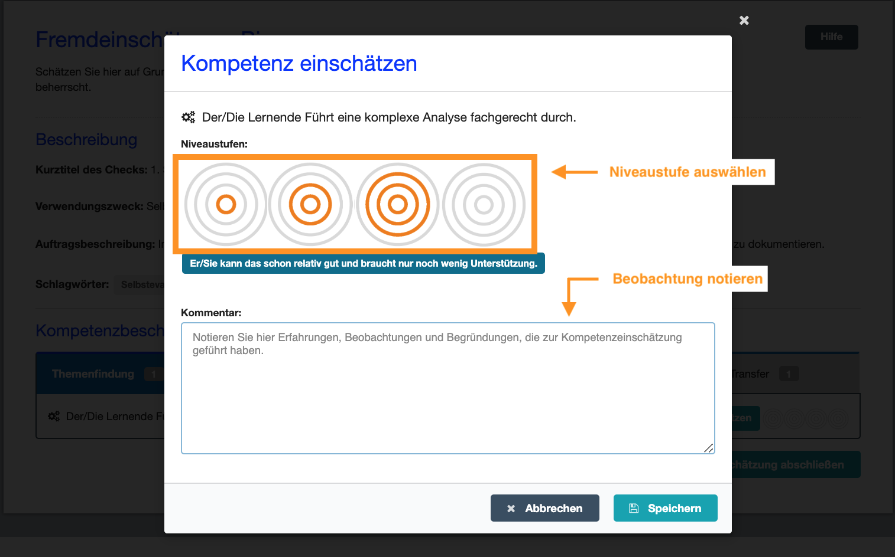

# Fremdeinschätzung

- - -

## Was ist eine Fremdeinschätzung?
Sie wurden dazu eingeladen, eine Fremdeinschätzung abzugeben. Dies bedeutet, dass Sie einschätzen sollen wie weit die Person, die Sie zum ContinuING Kompetenz-Check eingeladen hat, die beschriebenen Kompetenzen bereits entwickelt hat. Sie können Ihre Fremdeinschätzung entweder auf Grundlage Ihrer Wahrnehmung der Person oder auf Basis Ihrer Beobachtungen während der Auftragsbearbeitung durchführen. Ihre Fremdeinschätzung ist dann aussagekräftig, wenn Sie die Person bei der Auftragsdurchführung begleiten und regelmäßig Feedback zu durchgeführten Handlungen geben. 

Sie können Ihre Fremdeinschätzung immer wieder bearbeiten und an Ihre Beobachtungen anpassen. 

**Tipp: Speichern Sie sich den Link als Lesezeichen!**

## Wie führen Sie eine Fremdeinschätzung durch?
Klicken Sie rechts neben jeder Kompetenzbeschreibung auf den Button **einschätzen**, um eine Fremdeinschätzung zu dieser Kompetenz durchzuführen. Evtl. sind die Kompetenzbeschreibungen des Checks mehreren Phasen bzw. Reitern zugeordnet. Wechseln Sie zwischen den einzelnen Phasen, um alle Kompetenzen einzuschätzen (aktivierte Reiter sind blau).

Zur Einschätzung des Kompetenzvermögens der Person stehen Ihnen vier Niveaustufen (Kreissymbole) zur Verfügung. Wenn Sie eine Kompetenz nicht einschätzen können, wählen Sie nichts aus oder deaktivieren Sie die Auswahl durch erneutes Klicken in der Niveaustufe. Sichern Sie Ihre Angaben durch Klicken auf den Button **Speichern**. Sie können Ihre Fremdeinschätzung immer wieder bearbeiten und an Ihre Beobachtungen anpassen.

Die Niveaustufen beziehen sich auf beobachtbare Handlungen im Rahmen eines Lern- oder Forschungsprozesses, zu deren Ausführung die beschriebenen Kompetenzen benötigt werden. Jedes Kreissymbol steht exemplarisch für eine Könnensstufe bzw. Niveaustufe: 

* **Der Lerner/die Lernerin kann das noch nicht und braucht umfassende Unterstützung**: Der Lerner/die Lernerin hat bisher noch keine Erfahrungen gesammelt und führt die Handlungen zum ersten Mal durch, daher benötigt er bzw. sie Hilfestellung oder Anleitung durch eine weitere Person
* **Der Lerner/die Lernerin kann das erst ein bisschen und braucht noch relativ viel Unterstützung**: Der Lerner/die Lernerin verfügt bereits über erste Erfahrungen, fühlt sich aber sicherer, wenn eine weitere Person ihn bzw. sie unterstützt z.B. durch Anleitung oder Beantwortung von Fragen
* **Der Lerner/die Lernerin kann das schon relativ gut und braucht nur noch wenig Unterstützung**: Der Lerner/die Lernerin hat schon viele Erfahrungen gesammelt, kann die Handlungen selbstständig durchführen und möchte evtl. nur einzelne Rückfragen stellen.
* **Der Lerner/die Lernerin kann das sehr gut und braucht keine weitere Unterstützung**: Der Lerner/die Lernerin hat schon so viele Erfahrungen gesammelt, dass er bzw. sie die Handlungen selbstständig und ohne weitere Hilfestellung durchführen kann.

Indem Sie eine Niveaustufe (Kreissymbol) anklicken, halten Sie Ihrer Wahrnehmung nach fest, wie gut die von Ihnen beobachtete bzw. einzuschätzende Person die beschriebene Kompetenz zum aktuellen Zeitpunkt beherrscht. 

Schreiben Sie einen **Kommentar** zu jeder Einschätzung, damit Sie im Auswertungsgespräch nachvollziehen können, warum Sie die Person so eingeschätzt haben. 

Beenden Sie die gesamte Fremdeinschätzung, indem Sie den Button **Einschätzung abschließen** klicken. Ihre erste Fremdeinschätzung ist nun gespeichert und kann **nicht** mehr bearbeitet werden.

## Wie geht es nach der Fremdeinschätzung weiter?
* **Zum Auswertungsgespräch auffordern**: Fordern Sie die Person, welche Sie zur Fremdeinschätzung eingeladen hat auf, den Check abzuschließen und gemeinsam mit Ihnen im Auswertungsgespräch die Selbst- und Fremdeinschätzungen zu besprechen.

