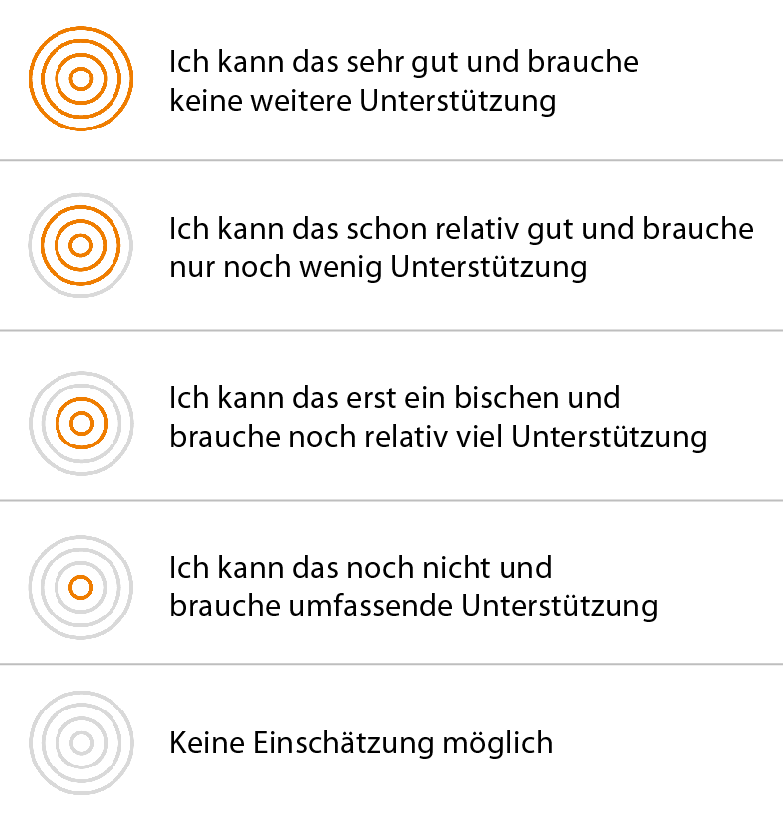

# Fremdeinschätzung
Sie wurden dazu eingeladen, eine Fremdeinschätzung abzugeben. Dies bedeutet, dass Sie einschätzen, wie weit die Person, 
die Sie zum Kompetenz-Check eingeladen hat, die beschriebenen Kompetenzen bereits entwickelt hat. 
Sie können Ihre Fremdeinschätzung entweder auf Grundlage Ihrer Wahrnehmung der Person, oder auf Basis Ihrer Beobachtungen während der 
Auftragsbearbeitung durchführen. Zur Einschätzung des Kompetenzvermögens der anderen Person stehen Ihnen vier Niveaustufen zur Verfügung, 
wenn Sie eine Kompetenz nicht einschätzen können, wählen Sie die Checkbox „Einschätzung nicht möglich“.
Die Einschätzungsstufen beziehen sich auf beobachtbare Handlungen im Rahmen der Auftragsbearbeitung, zu deren Ausführung die beschriebene Kompetenz benötigt wird. 

Eine Fremdeinschätzung trägt dann zur Kompetenzerfassung und -entwicklung bei, wenn Sie die Person bei der Auftragsdurchführung begleiten und 
regelmäßig Feedback zu durchgeführten Handlungen geben. Im abschließenden Auswertungsgespräch stehen dann die gemeinsamen Erfahrungen während 
der Auftragsbearbeitung im Vordergrund. Gemeinsam überlegen Sie dann, wie die identifizierten Stärken und Entwicklungsmöglichkeiten der Person 
methodisch unterstützt werden können. 

**Diese Fragen unterstützen Ihre Fremdeinschätzung:**
* In welcher Handlungssituation soll die Kompetenz eingeschätzt werden: Nutzen Sie die Informationen zum Arbeitsauftrag: Auftragstitel, Auftragsbeschreibung, Verwendungszweck.
* Haben Sie die Person zuvor bereits in einer ähnlichen Arbeitssituation beobachtet: Fremdeinschätzung auf Basis von Erfahrungen und Wahrnehmungen
* Haben Sie die Person während des aktuellen Arbeitsprozesses begleitet und beobachtet: Fremdeinschätzung auf Basis von Beobachtungen
* Wann führen Sie die Fremdeinschätzung durch: Notieren Sie das Datum
* Warum möchten Sie das Kompetenzvermögen der Person einschätzen: Gründe siehe oben.
* Welche Handlungen haben Sie beobachtet: Notiz
* Wie würden Sie die Durchführung der Handlungen beschreiben, was konnten Sie beobachten: Notiz
* Welcher Niveaustufe können Sie Ihre Beobachtungen/ Erfahrungen zuordnen: Wählen Sie eine Niveaustufe aus
* Welche Gründe/Beobachtungen haben zur Auswahl der Niveaustufe geführt: Notiz

Notieren Sie sich zur Vorbereitung auf das Auswertungsgespräch zu jeder Einschätzung einen Kommentar.

** Sie können jetzt Folgendes tun:**
* Eine weitere Fremdeinschätzung abgeben: Informieren Sie die Person und lassen Sie sich einladen. Machen Sie sich Notizen, um im Auswertungsgespräch die unterschiedlichen Fremdeinschätzungen bestimmten Handlungen oder Arbeitsprozessphasen zuordnen zu können.
* Zum Auswertungsgespräch auffordern: Vereinbaren Sie mit der Person die Durchführung eines Auswertungsgespräch, um die Einschätzung auszuwerten.
