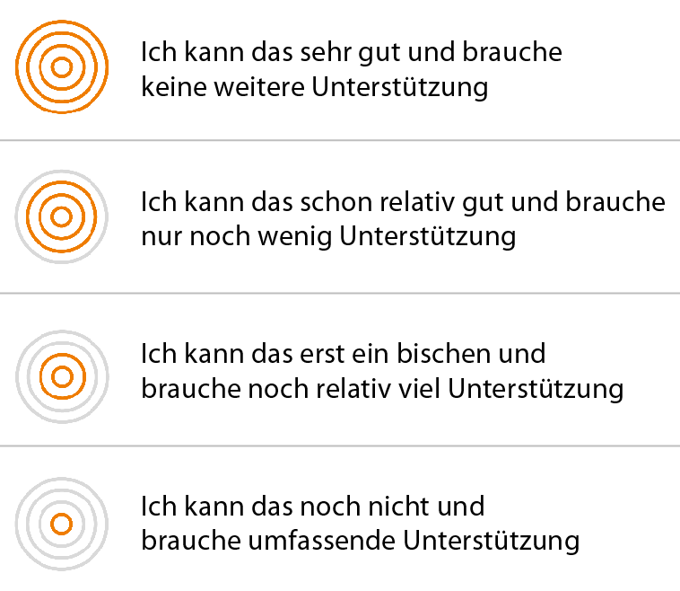

# Fremdeinschätzung
Sie wurden dazu eingeladen, eine Fremdeinschätzung abzugeben. Dies bedeutet, dass Sie einschätzen sollen, wie weit die Person, die Sie zum Kompetenz-Check eingeladen hat, die beschriebenen Kompetenzen bereits entwickelt hat. Sie können Ihre Fremdeinschätzung entweder auf Grundlage Ihrer Wahrnehmung der Person, oder auf Basis Ihrer Beobachtungen während der Auftragsbearbeitung durchführen. Ihre Fremdeinschätzung ist dann aussagekräftig, wenn Sie die Person bei der Auftragsdurchführung begleiten und regelmäßig Feedback zu durchgeführten Handlungen geben. 
Sie können Ihre Fremdeinschätzung immer wieder bearbeiten und an Ihre Beobachtungen anpassen. Tipp: Speichern Sie sich den Link als Lesezeichen!

# Fremdeinschätzung
Sie wurden dazu eingeladen, eine Fremdeinschätzung abzugeben. Dies bedeutet, dass Sie einschätzen sollen, wie weit die Person, die Sie zum Kompetenz-Check eingeladen hat, die beschriebenen Kompetenzen bereits entwickelt hat. Sie können Ihre Fremdeinschätzung entweder auf Grundlage Ihrer Wahrnehmung der Person, oder auf Basis Ihrer Beobachtungen während der Auftragsbearbeitung durchführen. Ihre Fremdeinschätzung ist dann aussagekräftig, wenn Sie die Person bei der Auftragsdurchführung begleiten und regelmäßig Feedback zu durchgeführten Handlungen geben. 

Zur Einschätzung des Kompetenzvermögens der anderen Person stehen Ihnen vier Niveaustufen zur Verfügung, wenn Sie eine Kompetenz nicht einschätzen können, wählen Sie die Checkbox „Einschätzung nicht möglich“. Die Einschätzungsstufen beziehen sich auf beobachtbare Handlungen im Rahmen der Auftragsbearbeitung, zu deren Ausführung die beschriebenen Kompetenzen benötigt werden. 

Wählen Sie zur Fremdeinschätzung einer Kompetenzbeschreibung eine Niveaustufe aus. Damit Sie später nachvollziehen können, warum Sie die Person so eingeschätzt haben, ist es hilfreich, einen Kommentar zu jeder Einschätzung zu verfassen. Speichern Sie Ihre Einschätzung, indem Sie den Button „Einschätzung speichern“ klicken. Verfahren Sie so mit allen weiteren Kompetenzbeschreibungen im Check und beenden Sie die gesamte Fremdeinschätzung, indem Sie oben rechts den Button „Einschätzung abschließen“ klicken. Ihre Fremdeinschätzung ist nun gespeichert und kann nicht mehr bearbeitet werden. 

**Sie können jetzt Folgendes tun:**

* Zum Auswertungsgespräch auffordern: Fordern Sie die Person auf, den Check abzuschließen und gemeinsam mit Ihnen im Auswertungsgespräch die Selbst- und Fremdeinschätzungen zu besprechen.

**Sie können jetzt Folgendes tun:**
* Zum Auswertungsgespräch auffordern: Fordern Sie die Person auf, den Check abzuschließen und gemeinsam mit Ihnen im Auswertungsgespräch die Selbst- und Fremdeinschätzungen zu besprechen.
