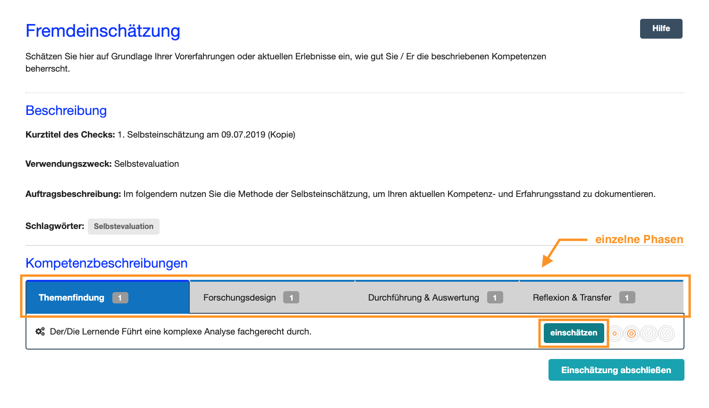

# Eine Fremdeinschätzung durchführen

Zur Einschätzung des Kompetenzvermögens der anderen Person stehen Ihnen vier Niveaustufen zur Verfügung. Wenn Sie eine Kompetenz nicht einschätzen können, wählen Sie die Checkbox **Einschätzung nicht möglich**. 

Die Niveaustufen beziehen sich auf beobachtbare Handlungen im Rahmen der Auftragsbearbeitung, zu deren Ausführung die beschriebenen Kompetenzen benötigt werden. 

Zur Fremdeinschätzung des Könnens einer weiteren Person wählen Sie pro Kompetenzbeschreibung eines der vier Kreissymbole bzw. die Checkbox aus. Jedes Kreissymbol steht exemplarisch für eine Könnensstufe bzw. Niveaustufe: 

* **Der Lerner/die Lernerin kann das noch nicht und braucht umfassende Unterstützung**: Der Lerner/die Lernerin habt bisher noch keine Erfahrungen gesammelt und führt die Handlungen zum ersten Mal durch, daher benötigt er bzw. sie Hilfestellung oder Anleitung durch eine weitere Person
* **Der Lerner/die Lernerin kann das erst ein bischen und braucht noch relativ viel Unterstützung**: Der Lerner/die Lernerin verfügt bereits über erste Erfahrungen, fühlt sich aber sicherer, wenn eine weitere Person ihn bzw. sie unterstützt z.B. durch Anleitung oder Beantwortung von Fragen
* **Der Lerner/die Lernerin kann das schon relativ gut und braucht nur noch wenig Unterstützung**: Der Lerner/die Lernerin hat schon viele Erfahrungen gesammelt, kann die Handlungen selbstständig durchführen und möchte evtl. nur einzelne Rückfragen stellen.
* **Der Lerner/die Lernerin kann das sehr gut und braucht keine weitere Unterstützung**: Der Lerner/die Lernerin hat schon so viele Erfahrungen gesammelt, dass er bzw. sie die Handlungen selbstständig und ohne weitere Hilfestellung durchführen kann.

Indem Sie eine Niveausstufe (Kreissymbol) anklicken halten Sie Ihrer Wahrnehmung nach fest, wie gut die von Ihnen beobachtete bzw. einzuschätzende Person die beschriebene Kompetenz zum aktuellen Zeitpunkt beherrscht. 

Schreiben Sie einen **Kommentar** zu jeder Einschätzung, damit Sie im Auswertungsgespräch nachvollziehen können, warum Sie die Person so eingeschätzt haben. 

Speichern Sie Ihre Einschätzung, indem Sie den Button **Einschätzung speichern** rechts oberhalb der Kompetenzbeschreibung klicken.
Verfahren Sie so mit allen weiteren Kompetenzbeschreibungen im Check. Sie können Ihre Fremdeinschätzung immer wieder bearbeiten und an Ihre Beobachtungen anpassen. 

Beenden Sie die gesamte Fremdeinschätzung, indem Sie oben rechts den Button 
**Einschätzung abschließen** klicken. Ihre erste Fremdeinschätzung ist nun gespeichert und kann nicht mehr bearbeitet werden. Die Durchführung des Kompetenz-Checks 
kann beginnen.

## Wie geht es nach der Fremdeinschätzung weiter?
* **Zum Auswertungsgespräch auffordern**: Fordern Sie die Person, welche Sie zur Fremdeinschätzung eingeladen hat auf, den Check abzuschließen und gemeinsam mit Ihnen im Auswertungsgespräch die Selbst- und Fremdeinschätzungen zu besprechen.

