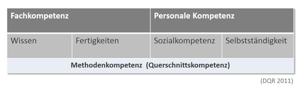

# Kompetenzbeschreibungen hinzufügen

Sie müssen nicht allen Phasen Kompetenzbeschreibungen hinzufügen. Je nach Zielsetzung und Szenario entscheiden Sie, worauf Sie Ihren Fokus setzen möchten!

Jede Kompetenzbeschreibung muss einem Kompetenzbereich zugeordnet werden. Unter Fachkompetenz wird das Wissen und
die Fertigkeiten verstanden, die zur Bearbeitung des Auftrages benötigt werden. Die Personale Kompetenz gliedert sich in
„Sozialkompetenz“ (u. a. Zusammenarbeit und Kommunikation mit Anderen) und
"Selbstständigkeit" (u. a. Zeit- und Aufgabenmanagement, Bereitschaft zum Lernen, Fähigkeit und Bereitschaft zum Feedback Geben und Nehmen).

## Wie formuliere ich eine Kompetenzbeschreibung?
Die Kompetenzbeschreibung sollte einen konkreten Bezug zum bereits formulierten Arbeits- oder Forschungsauftrag haben und möglichst genau die auszuführende, 
bzw. zu beobachtende Handlung beschreiben. Eine Kompetenzbeschreibung muss immer in der 3. Person singular formuliert werden.  

Die Kompetenzbeschreibung soll konkret und in ganzen Sätzen unter Verwendung beobachtbarer Verben (Operatoren)
formuliert werden, das heißt sie soll „beobachtbar“ sein. Tipps für beobachtbare Verben für Fach- und Personale Kompetenz: 
<a href="media/Verben_fuer_Kompetenzbeschreibung.pdf" target="_blank">Verben für die Kompetenzbeschreibung: Beispiele</a>

**Formulierung einer Kompetenzbeschreibung:**

Der Lerner + Verb (Operator) + Inhalt/Bezug der Handlung + Situation + Kontext der Handlung +
ggf. spezifisches Kriterium

Beispiel: Der Lernende analysiert Probleme durch Recherche in gängigen Foren und erarbeitet Lösungen
auch in englischer Sprache.

  **Beispiele:** 
  
* Personale Kompetenz: Der Lernende erarbeitet die Planung des Arbeitsauftrags
kooperativ in der Gruppe und stimmt sich ab.

* Fachkompetenz: Der Lernende erstellt einen Projektplan fachgerecht.

## Wie geht es nach dem Anlegen des Checks weiter?
Sobald Sie Ihren Check gespeichert haben, gelangen Sie wieder auf die Seite **Dashboard**. 
Rechts neben dem Check werden Ihnen nun weitere **Aktionsmöglichkeiten** angeboten:
* Eine Selbsteinschätzung durchführen: Wählen Sie auf dem Dashboard die Aktionsmöglichkeit **Selbsteinschätzung durchführen**.
* Den Check einer weiteren Person zuweisen: Wählen Sie auf dem Dashboard die Aktionsmöglichkeit **Check zuweisen**.

