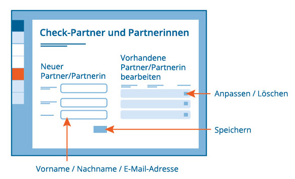

# Partner und Partnerinnen

Hier können Sie Checkpartner und Checkpartnerinnen hinzufügen und verwalten. 

- - -

## Was sind Check-Partner und Check-Partnerinnen?
Diese Verwaltung bietet Ihnen den Vorteil, dass Sie den hier eingetragenen
Checkpartner/innen schnell und einfach einen von Ihnen erstellten Kompetenz-Check
zuweisen sowie eine Einladung zu einer Fremdeinschätzung zuschicken
können.

## Wie lege ich einen neuen Partner bzw. Partnerin an?

Durch die Angabe des Namens und der E-Mail-Adresse fügen Sie einen/eine neue/n Checkpartner/in hinzu.
Ebenso können Sie die Daten vorhandener Partner/innen bearbeiten oder löschen.

## Wie bearbeite ich bereits vorhandene Partner und Partnerinnen?

