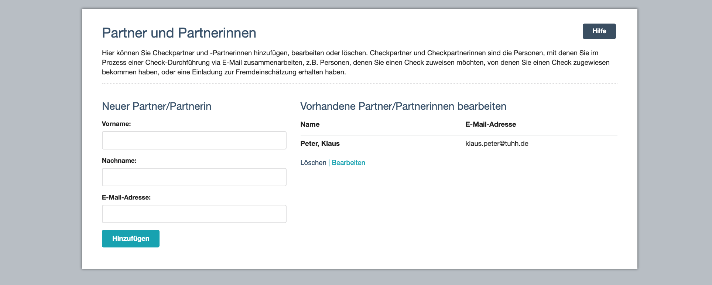

# Partner und Partnerinnen

Hier können Sie Checkpartner und Checkpartnerinnen hinzufügen und verwalten. 

- - -

## Was sind Check-Partner und Check-Partnerinnen?

Check-Partner bzw. Check-Partnerinnen sind die Personen, denen Sie einen Check zuweisen, oder die Sie zur Fremdeinschätzung einladen wollen bzw. von denen Sie bereits einen Check zugewiesen bekommen haben oder zur Fremdeinschätzung eingeladen wurden. Die Verwaltung von Partnern bzw. Partnerinnen erleichtert Ihnen die Arbeit mit dem Kompetenz-Check, indem Sie schnell auf häufig genutzte Kontakte zugreifen können.

## Wie lege ich einen neuen Partner bzw. Partnerin an?

Sie legen neue Check-Partner und Check-Partnerinnen durch Angabe des Vor- und Nachnamens sowie der E-Mail-Adresse an. 

## Wie bearbeite ich bereits vorhandene Partner und Partnerinnen?

Zur Verwaltung bereits angelegter Partner und Partnerinnen stehen Ihnen zwei Funktionen zur Verfügung: **Bearbeiten** oder **Löschen**.

