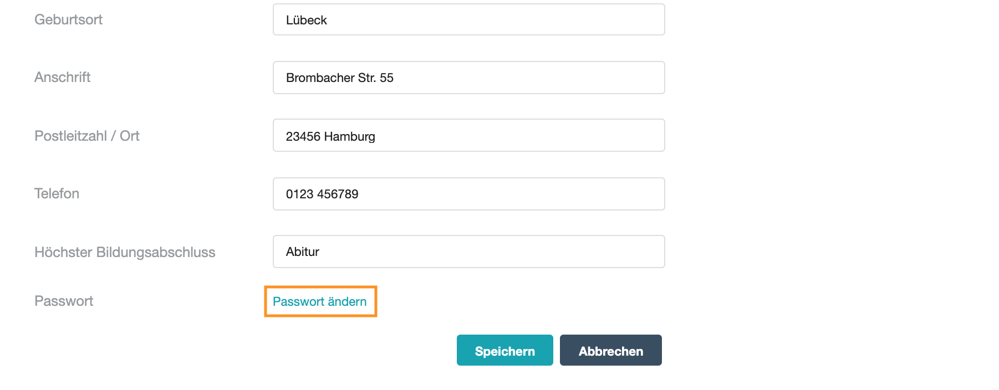
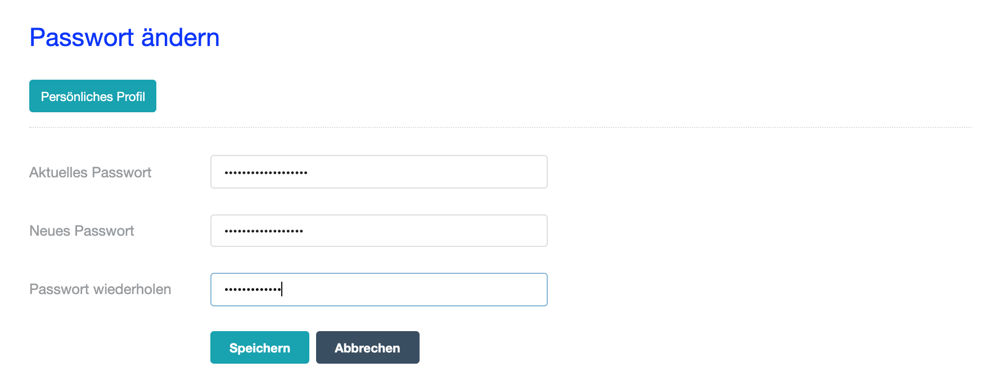

# Profil

- - -

Hier können Sie Ihre persönlichen Einstellungen verwalten.

## Wie bearbeite Sie Ihre persönlichen Einstellungen?
Klicken Sie auf das **Bearbeiten-Symbol** oben Rechts. Nun können Sie alle Formularfelder bearbeiten. Schließen Sie die Bearbeitung durch Anklicken des Buttons **Speichern** ab.

## Wie ändern Sie Ihr Passwort?
Unten auf der Seite können Sie Ihr **Passwort ändern**. 

Vergeben Sie ein langes und komplexes Passwort mit Buchstaben, Sonderzeichen und Zahlen. Speichern Sie die Bearbeitung über den Button **Speichern**.

## Wie löschen Sie Ihren ContinuING Kompetenz-Check Account?
Bitte schreiben Sie eine E-Mail mit dem Betreff **Kompetenz-Check Account löschen** unter Angabe Ihrer registrierten E-Mail-Adresse an team@ausbildungsportfolio.net. Sobald Ihre Daten gelöscht wurden, melden wir uns umgehend bei Ihnen zurück.