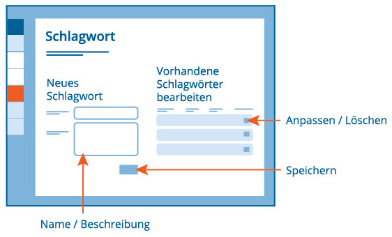

# Schlagwörter

- - - 
Auf dieser Seite erstellen und verwalten Sie Ihre Schlagwörter.

## Was sind Schlagwörter?
Ein Schlagwort ist ein frei vom Nutzer bzw. der Nutzerin zu vergebener Begriff, um Inhalte zu kategorisieren und zu kennzeichnen. Schlagworte werden auch als "Tags" bezeichnet. Im Kompetenz-Check können Sie einem Check Schlagwörter hinzufügen, um Ihre Checks inhaltlich zu sortieren und auf dem Dashboard über den Schlagwort-Filter schnell wieder zu finden. Als Schlagwörter eignen sich z.B. Begriffe, die sich inhaltlich auf den Titel, den Verwendungszweck, den Arbeitsauftrag zum Check oder die Zielgruppe des Checks beziehen.

## Wie lege ich ein neues Schlagwort an?
Fügen Sie ein neues Schlagwort hinzu, indem Sie einen treffenden Namen (das Schlagwort) und eine Beschreibung des Schlagwortes hinzufügen, um auch später nachvollziehen zu können, was Sie unter dem Schlagwort verstehen. 

## Wie bearbeite oder lösche ich ein Schlagwort?
Zur Bearbeitung oder zum Löschen eines bereits vorhandenen Schlagwortes nutzen Sie die Funktionen **Bearbeiten** und **Löschen**.
Hier wird Ihnen auch angezeigt, wie oft Sie ein Schlagwort bereits vergeben haben.

