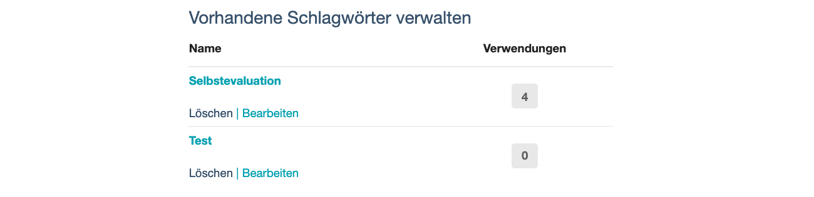

# Schlagwörter
- - -

## Was sind Schlagwörter?
Ein Schlagwort ist ein frei zu vergebener Begriff, um Inhalte zu kategorisieren und zu kennzeichnen. Schlagwörter werden auch als "Tags" bezeichnet. Im ContinuING Kompetenz-Check können Sie einem Check Schlagwörter hinzufügen, um Ihre Checks inhaltlich zu sortieren. Als Schlagwörter eignen sich z.B. Begriffe, die sich inhaltlich auf den Titel, den Verwendungszweck, den Arbeitsauftrag zum Check oder die Zielgruppe des Checks beziehen.

## Wie legen Sie ein neues Schlagwort an?
Fügen Sie ein neues Schlagwort hinzu, indem Sie einen treffenden Begriff (das Schlagwort) und eine Beschreibung des Schlagwortes hinzufügen, um auch später nachvollziehen zu können, was Sie unter dem Schlagwort verstehen.

## Wie bearbeiten oder löschen Sie ein Schlagwort?
Zur Bearbeitung oder zum Löschen eines bereits vorhandenen Schlagwortes nutzen Sie die Funktionen **Bearbeiten** und **Löschen**.

## Wie oft wurde ein Schlagwort verwendet?
Rechts neben jedem Schlagwort wird Ihnen die Anzahl seiner Verwendungen angezeigt. Klicken Sie auf das Schlagwort oder die Zahl, um zu erfahren, für welche Checks Sie das Schlagwort bereits vergeben haben. So gelangen Sie auf eine Seite, auf der Ihnen alle mit dem Schlagwort verknüpften Checks angezeigt werden.

