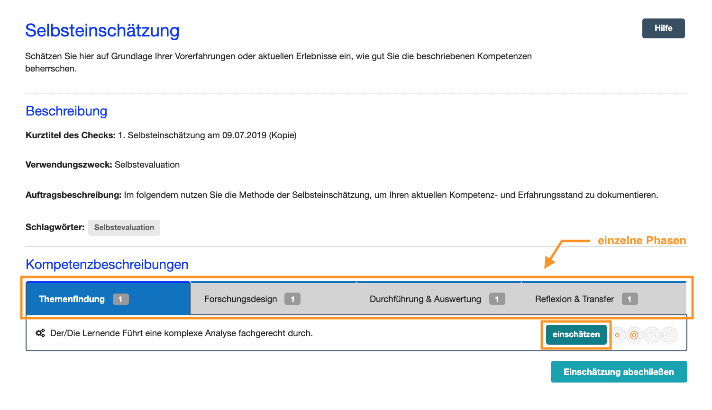

# 1. Was ist eine Selbsteinschätzung?

Auf dieser Seite führen Sie eine Selbsteinschätzung zu den im Check beschriebenen Kompetenzen durch.
Dafür schätzen Sie z. B. auf Grundlage Ihrer Vorerfahrungen zu dem Thema oder Arbeitsauftrag ein, wie gut, 
also auf welcher Niveaustufe, Sie die beschriebenen Kompetenzen bereits beherrschen. Eine Selbsteinschätzung sollten Sie bestmöglich eigenständig 
und ohne die Hilfe Dritter durchführen, um Ihre individuellen Einschätzungen festzuhalten.

Bei der Selbsteinschätzung von Kompetenzen überlegen Sie auf Grundlage Ihrer Selbstwahrnehmung und gesammelten Erfahrungen, 
wie gut Sie eine Kompetenz in der beschriebenen Auftragssituation beherrschen. Erinnern Sie sich hierfür an Situationen oder Arbeitsaufträge, 
in denen sie diese oder ähnliche Kompetenzhandlungen bereits durchgeführt haben. Nutzen Sie hierfür auch die Informationen 
zum Auftrag im Kompetenzcheck: Auftragstitel, Auftragsbeschreibung, Verwendungszweck. Dokumentieren Sie Ihre Selbstwahrnehmung in der Software, 
indem Sie pro Kompetenz auf vier Niveaustufen einschätzen, wie gut Sie diese Kompetenz zum aktuellen Zeitpunkt beherrschen. 

Im Kompetenz-Check gibt es zwei Arten von Selbsteinschätzungen:
Die **erste Selbsteinschätzung** führen Sie, je nach Szenario, **vor** der Auftragsbearbeitung oder dem Auswertungsgespräch durch. Diese 

vor der Auftragsbearbeitung Mit Ihrer ersten Selbsteinschätzung beginnt die Durchführung des Kompetenz-Checks. 

### Sie können jetzt Folgendes tun:
* Eine weitere Selbsteinschätzung durchführen: Wählen Sie auf dem Dashboard die Aktionsmöglichkeit „Weitere Selbsteinschätzung durchführen“.
* Eine Fremdeinschätzung einfordern: Wählen Sie auf dem Dashboard die Aktionsmöglichkeit „Jemanden zu einer Fremdeinschätzung einladen“.
* Den Kompetenz-Check beenden und die Auswertung starten: Wählen Sie auf dem Dashboard die Aktionsmöglichkeit „Alle Einschätzungen abschließen: Auswertung beginnen“.

## Weitere Selbsteinschätzungen

Nach der ersten Selbsteinschätzung und mit Beginn der Durchführung des Kompetenz-Checks können Sie weitere Selbsteinschätzungen durchführen. Verfahren Sie dabei wie bei der ersten Einschätzung. Jede weitere Selbsteinschätzung kann bis zum Beenden des Kompetenz-Checks immer wieder von Ihnen bearbeitet werden. Notieren Sie Ihre Begründungen zur Veränderung Ihrer Selbsteinschätzung im Kommentarfeld.

