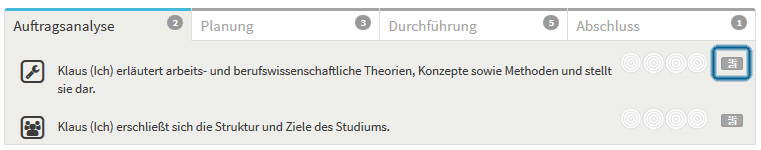

# Selbsteinschätzung
- - -
Auf dieser Seite führen Sie eine Selbsteinschätzung zu den im Check beschriebenen Kompetenzen durch.

## Was ist eine Selbsteinschätzung?

Bei einer Selbsteinschätzung bewerten Sie bzw. schätzen Sie Ihre Fähigkeiten und Kompetenzen zu einem bestimmten Zeitpunkt ein. 
Es handelt sich somit um eine Bestandsaufnahme Ihres Könnens im Rahmen einer bestimmten Situation: 
z. B. wärend der Bearbeitung eines spezifischen Arbeitsauftrages.

Im Kompetenz-Check gibt es zwei Arten von Selbsteinschätzungen: 
* Die **erste Selbsteinschätzung** führen Sie, je nach Szenario, **vor** der Auftragsbearbeitung oder dem Auswertungsgespräch durch. Mit der ersten Selbsteinschätzung startet die Durchführung eines Checks. Die erste Selbsteinschätzung kann nach dem Speichern nicht mehr bearbeitet werden.
* Nachdem Sie die erste Selbsteinschätzung durchgeführt haben, können Sie beliebig viele **weitere Selbsteinschätzungen** durchführen. Fügen Sie jeder Einschätzung einen **Kommentar** hinzu, um festzuhalten, warum Sie sich zu diesem Zeitpunkt so einschätzen. Weitere Selbsteinschätzungen können Sie bis zum Abschluss des Checks immer wieder bearbeiten.

## Wie führe ich eine Selbsteinschätzung durch?
Um eine Selbsteinschätzung durchzuführen schätzen Sie z. B. auf Grundlage Ihrer Vorerfahrungen zu dem Thema oder Arbeitsauftrag ein, wie gut Sie die beschriebenen Kompetenzen 
beherrschen. Erinnern Sie sich hierfür an Situationen oder Arbeitsaufträge, in denen sie diese oder ähnliche Handlungen bereits durchgeführt haben. Um welche Auftragssituation es sich handelt erfahren Sie unter dem Punkt **Auftragsbeschreibung**.  

Klicken Sie auf den **Button rechts neben einer Kompetenzbeschreibung**, um eine Selbsteinschätzung zu dieser Kompetenz durchzuführen. 

Zur Einschätzung Ihres Könnens wählen Sie pro Kompetenzbeschreibung eines der vier Kreissymbole aus. Jedes Kreissymbol steht exemplarisch für eine Könnensstufe bzw. Niveaustufe: 

* **Ich kann das noch nicht und brauche umfassende Unterstützung**: Sie haben bisher noch keine Erfahrungen gesammelt und führen die Handlungen zum ersten Mal durch, daher benötigen Sie Hilfestellung oder Anleitung durch eine weitere Person
* **Ich kann das erst ein bischen und brauche noch relativ viel Unterstützung**: Sie verfügen bereits über erste Erfahrungen, fühlen sich aber sicherer, wenn eine weitere Person Sie unterstützt z.B. durch Anleitung oder Beantwortung von Fragen
* **Ich kann das schon relativ gut und brauche nur noch wenig Unterstützung**: Sie haben schon viele Erfahrungen gesammelt, können die Handlungen selbstständig durchführen und möchten evtl. nur einzelne Rückfragen stellen.
* **Ich kann das sehr gut und brauche keine weitere Unterstützung**: Sie haben schon so viele Erfahrungen gesammelt, dass Sie die Handlungen selbstständig und ohne weitere Hilfestellung durchführen können.

Indem Sie eine Niveausstufe (Kreissymbol) anklicken halten Sie fest, wie gut Sie die beschriebene Kompetenz zum aktuellen Zeitpunkt beherrschen. 
Führen Sie eine Selbsteinschätzung bestmöglich eigenständig und ohne die Hilfe Dritter durch.

Schreiben Sie einen **Kommentar** zu jeder Einschätzung, damit Sie im Auswertungsgespräch nachvollziehen können, warum Sie sich so eingeschätzt haben. 

Speichern Sie Ihre Einschätzung, indem Sie den Button **Einschätzung speichern** rechts oberhalb der Kompetenzbeschreibung klicken.
Verfahren Sie so mit allen weiteren Kompetenzbeschreibungen im Check und beenden Sie die gesamte Selbsteinschätzung, indem Sie oben rechts den Button 
**Einschätzung abschließen** klicken. Ihre erste Selbsteinschätzung ist nun gespeichert und kann nicht mehr bearbeitet werden. Die Durchführung des Kompetenz-Checks 
kann beginnen.

## Wie geht es nach der ersten Selbsteinschätzung weiter?
Sobald Sie Ihre erste Selbsteinschätzung bzw. eine weitere Selbsteinschätzung gespeichert haben, gelangen Sie wieder auf die Seite **Dashboard**. 
Rechts neben dem Check werden Ihnen nun weitere **Aktionsmöglichkeiten** angeboten:
* Eine weitere Selbsteinschätzung durchführen: Wählen Sie auf dem Dashboard die Aktionsmöglichkeit **Weitere Selbsteinschätzung durchführen**.
* Eine Fremdeinschätzung einfordern: Wählen Sie auf dem Dashboard die Aktionsmöglichkeit **Jemanden zu einer Fremdeinschätzung einladen**.
* Den Kompetenz-Check beenden und die Auswertung starten: Wählen Sie auf dem Dashboard die Aktionsmöglichkeit **Alle Einschätzungen abschließen: Auswertung beginnen**.

## Warum sollte ich weitere Selbsteinschätzungen durchführen?

Führen Sie weitere Selbsteinschätzungen während der Auftragsbearbeitung durch, wenn Sie herausfinden wollen, wie sich Ihr Können bzw. die Wahrnehmung Ihres Könnens über einen bestimmten Zeitraum verändert. 
Schätzen Sie dann nur die Kompetenzen ein, die Sie gerade in der Auftragsbearbeitung eingesetzt haben, z. B. nur in der Auftragsanalyse oder Planungsphase.
Führen Sie eine weitere Selbsteinschätzung durch, **bevor Sie den Check abschließen**. So erfahren Sie, ob sich Ihr Können im Vergleich zur ersten Selbsteinschätzung verändert hat.
Sie können jede weitere Selbsteinschätzung bis zum Abschluss des Checks immer wieder bearbeiten. Notieren Sie dann die Begründungen zur Veränderung Ihrer Selbsteinschätzung im Kommentarfeld.

## Warum kann ich meine erste Selbsteinschätzung nach dem Speichern nicht mehr einsehen oder bearbeiten?
Ihre erste Selbsteinschätzung ist eine Momentaufnahme Ihres Könnens zu Beginn jedes Checks. Typischerweise führen Sie die erste Selbsteinschätzung 
vor der Bearbeitung eines Auftrages oder eines längeren Lernprozesses durch. Wir wollen Ihnen die Möglichkeit geben, 
Ihr Können in weiteren Selbsteinschätzungen immer wieder neu einzuschätzen. Das Ergebnis Ihrer ersten Selbsteinschätzung sehen Sie, wenn Sie den Check abschließen.
In der Check-Auswertung werden alle Selbst- und Fremdeinschätzungen der ersten Selbsteinschätzung gegenüber gestellt. So erfahren Sie, ob sich Ihre Einschätzungen 
im Verlauf der Check-Durchführung verändert haben, oder ob es Unterschiede zwischen Selbst- und Fremdeinschätzungen gibt.

## Wer sieht meine Selbsteinschätzungen?
Ihre Selbsteinschätzungen gehören Ihnen! Keine weitere Person kann diese einsehen. Bei der Auswertung des Checks bestimmen Sie über die Zusammenstellung der Daten für das Auswertungsgespräch.

