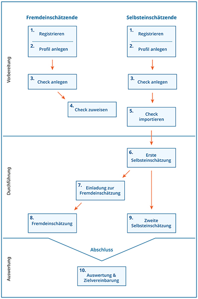

# Der ContinuING@TUHH Kompetenz-Check 

- - -

Willkommen im Kompetenz-Check des Projekts ContinuING@TUHH. Der Kompetenz-Check begleitet Sie in der Erfassung und Förderung von Handlungskompetenzen in Lern-, Forschungs- und Arbeitsprozessen. Durch die Gegenüberstellung von Selbst- und Fremdeinschätzungen werden eigene Kompetenzen bewusst gemacht und mit individuellen Entwicklungszielen verknüpft. Legen Sie einen Kompetenz-Check an, schätzen Sie Ihre Stärken ein, oder geben Sie einer weiteren Person Feedback.

**Hier sehen Sie den idealtypischen Ablauf eines Kompetenz-Checks, oder einfach kurz Checks:**

