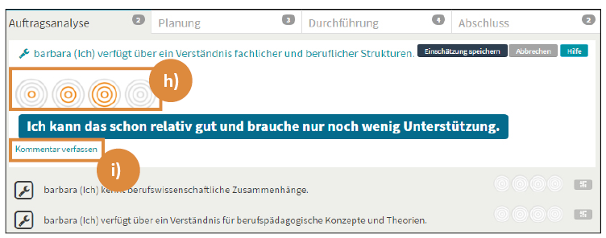

## Test Grafik für KC-Tutorial

<b> h) </b> Fahren Sie mit der Maus über die vier Kreissymbole. Jeder Kreis entspricht einem Einschätzungsniveau. Schätzen Sie nun auf Grundlage Ihrer Vorerfahrungen ein, wie gut Sie die beschriebene Kompetenz bereits ausgebildet haben. Klicken Sie dafür den Ihrer Einschätzung entsprechenden Kreis an, sodass er sich orange färbt.

<b> i) </b> Kommentieren Sie nun Ihre Einschätzung, indem Sie den Button <b> Kommentar verfassen </b>, unter den Kreissymbolen, anklicken. 